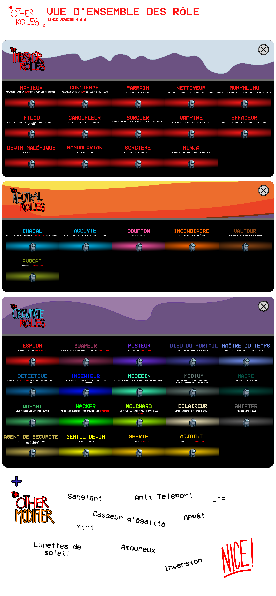
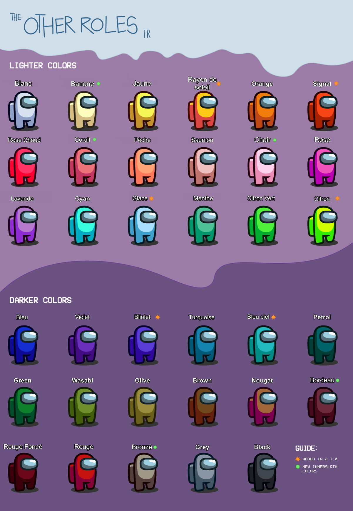

<p align="center"><a href="https://github.com/omega7711/TheOtherRolesFR/releases"></a></p>

<p align="center">
Ce mod n'est pas affilié avec Among Us ou Innersloth LLC, et le contenu n'est pas fait ou sponsorisé par Innersloth LLC. Ce qu'il y a à l'intérieur de ce mod n'est pas la propriété d'Innersloth LLC. © Innersloth LLC.</p>
<p align="center"><a href="https://github.com/TheOtherRolesAU/TheOtherRoles"></a></p>
 
[](https://discord.gg/77RkMJHWsM)


# The Other Roles

**The Other Roles**, est un mod pour [Among Us](https://store.steampowered.com/app/945360/Among_Us) qui ajoute beaucoup de rôles, des nouveaux [Paramètres](#settings) et des nouveaux [Chapeaux Personnalisés](#chapeaux-personnalisés) au jeu.
Plus de rôles sont en cours de développement. :)

| Imposteurs | Crewmates | Neutres | Modificateurs |
|----------|-------------|-----------------|----------------|
| [Parrain (Mafia)](#mafia) | [Shifter](#shifter) | [Jester](#jester) | [Bloody](#bloody) |
| [Mafieux (Mafia)](#mafia) | [Mayor](#mayor) | [Arsonist](#arsonist) | [Anti Teleport](#anti-teleport) |
| [Concierge (Mafia)](#mafia) | [Engineer](#engineer) | [Jackal](#jackal) | [Tie Breaker](#tie-breaker) |
| [Morphling](#morphling) | [Sheriff](#sheriff) | [Sidekick](#sidekick) | [Bait](#bait) |
| [Camoufleur](#camoufleur) | [Deputy](#deputy) | [Vulture](#vulture) | [Lovers](#lovers) |
| [Vampire](#vampire) | [Lighter](#lighter) | [Lawyer](#lawyer) | [Sunglasses](#sunglasses) |
| [Effaceur](#effaceur) | [Detective](#detective) | [Poursuivant](#Poursuivant)| [Mini](#mini) |
| [Filou](#filou) | [Time Master](#time-master) | | [VIP](#vip) |
| [Nettoyeur](#nettoyeur) | [Medic](#medic) |  | [Invert](#invert) |
| [Sorcier](#sorcier) | [Swapper](#swapper) |
| [Mandalorian](#Mandalorian) | [Seer](#seer) |  |
| [Sorcière](#sorcière) | [Hacker](#hacker) |  |  |
| [Ninja](#ninja) | [Tracker](#tracker) |  |  |
| [Devin Maléfique](#Devin) | [Snitch](#snitch) |  |  |
|  | [Espion](#Espion) |  |  |
|  | [Portalmaker](#portalmaker) |  |  |
|  | [Security Guard](#security-guard) |  |  |
|  | [Medium](#medium) |  |  |
|  | [Nice Guesser](#guesser) |  |

La section [Assignement des rôles](#assignement-des-rôles) explique comment les rôles sont distribués parmis les joueurs.

# Versions
| Among Us - Version| Version du mod | Lien |
|----------|-------------|-----------------|
| 2022.6.21, 2022.7.12| v4.1.6| [Télécharger](https://github.com/omega7711/TheOtherRolesFR/releases/tag/v4.1.6)
| 2022.6.21, 2022.7.12| v4.1.5| [Télécharger (Version Anglaise)](https://github.com/Eisbison/TheOtherRoles/releases/download/v4.1.5/TheOtherRoles.zip)
| 2022.3.29| v4.1.4| [Télécharger (Version Anglaise)](https://github.com/Eisbison/TheOtherRoles/releases/download/v4.1.4/TheOtherRoles.zip)
| 2022.3.29| v4.1.3| [Télécharger (Version Anglaise)](https://github.com/Eisbison/TheOtherRoles/releases/download/v4.1.3/TheOtherRoles.zip)
| 2022.3.29| v4.1.2| [Télécharger (Version Anglaise)](https://github.com/Eisbison/TheOtherRoles/releases/download/v4.1.2/TheOtherRoles.zip)
| 2022.3.29| v4.1.1| [Télécharger (Version Anglaise)](https://github.com/Eisbison/TheOtherRoles/releases/download/v4.1.1/TheOtherRoles.zip)
| 2022.3.29| v4.1.0| [Télécharger (Version Anglaise)](https://github.com/Eisbison/TheOtherRoles/releases/download/v4.1.0/TheOtherRoles.zip)
| 2022.3.29s| v4.0.0| [Télécharger (Version Anglaise)](https://github.com/Eisbison/TheOtherRoles/releases/download/v4.0.0/TheOtherRoles.zip)
| 2022.3.29s| v3.4.5| [Télécharger (Version Anglaise)](https://github.com/Eisbison/TheOtherRoles/releases/download/v3.4.5/TheOtherRoles.zip)
| 2022.2.23s| v3.4.4| [Télécharger (Version Anglaise)](https://github.com/Eisbison/TheOtherRoles/releases/download/v3.4.4/TheOtherRoles.zip)
| 2021.12.15s| v3.4.3| [Télécharger (Version Anglaise)](https://github.com/Eisbison/TheOtherRoles/releases/download/v3.4.3/TheOtherRoles.zip)
| 2021.12.15s| v3.4.2| [Télécharger (Version Anglaise)](https://github.com/Eisbison/TheOtherRoles/releases/download/v3.4.2/TheOtherRoles.zip)
| 2021.12.15s| v3.4.1| [Télécharger (Version Anglaise)](https://github.com/Eisbison/TheOtherRoles/releases/download/v3.4.1/TheOtherRoles.zip)
| 2021.12.15s| v3.4.0| [Télécharger (Version Anglaise)](https://github.com/Eisbison/TheOtherRoles/releases/download/v3.4.0/TheOtherRoles.zip)
| 2021.12.15s| v3.3.3| [Télécharger (Version Anglaise)](https://github.com/Eisbison/TheOtherRoles/releases/download/v3.3.3/TheOtherRoles.zip)
| 2021.12.15s| v3.3.2| [Télécharger (Version Anglaise)](https://github.com/Eisbison/TheOtherRoles/releases/download/v3.3.2/TheOtherRoles.zip)
| 2021.12.14s| v3.3.1| [Télécharger (Version Anglaise)](https://github.com/Eisbison/TheOtherRoles/releases/download/v3.3.1/TheOtherRoles.zip)
| 2021.12.14s| v3.3.0| [Télécharger (Version Anglaise)](https://github.com/Eisbison/TheOtherRoles/releases/download/v3.3.0/TheOtherRoles.zip)
| 2021.11.9.5s| v3.2.4| [Télécharger (Version Anglaise)](https://github.com/Eisbison/TheOtherRoles/releases/download/v3.2.4/TheOtherRoles.zip)
| 2021.11.9.5s| v3.2.3| [Télécharger (Version Anglaise)](https://github.com/Eisbison/TheOtherRoles/releases/download/v3.2.3/TheOtherRoles.zip)
| 2021.11.9.5s| v3.2.2| [Télécharger (Version Anglaise)](https://github.com/Eisbison/TheOtherRoles/releases/download/v3.2.2/TheOtherRoles.zip)
| 2021.11.9.5s| v3.2.1| [Télécharger (Version Anglaise)](https://github.com/Eisbison/TheOtherRoles/releases/download/v3.2.1/TheOtherRoles.zip)
| 2021.11.9.5s| v3.2.0| [Télécharger (Version Anglaise)](https://github.com/Eisbison/TheOtherRoles/releases/download/v3.2.0/TheOtherRoles.zip)
| 2021.11.9.5s| v3.1.2| [Télécharger (Version Anglaise)](https://github.com/Eisbison/TheOtherRoles/releases/download/v3.1.2/TheOtherRoles.zip)
| 2021.11.9.5s| v3.1.1| [Télécharger (Version Anglaise)](https://github.com/Eisbison/TheOtherRoles/releases/download/v3.1.1/TheOtherRoles.zip)
| 2021.11.9.5s| v3.1.0| [Télécharger (Version Anglaise)](https://github.com/Eisbison/TheOtherRoles/releases/download/v3.1.0/TheOtherRoles.zip)
| 2021.11.9.5s| v3.0.0| [Télécharger (Version Anglaise)](https://github.com/Eisbison/TheOtherRoles/releases/download/v3.0.0/TheOtherRoles.zip)
| 2021.6.30s| v2.9.2| [Télécharger (Version Anglaise)](https://github.com/Eisbison/TheOtherRoles/releases/download/v2.9.2/TheOtherRoles.zip)
| 2021.6.30s| v2.9.1| [Télécharger (Version Anglaise)](https://github.com/Eisbison/TheOtherRoles/releases/download/v2.9.1/TheOtherRoles.zip)
| 2021.6.30s| v2.9.0| [Télécharger (Version Anglaise)](https://github.com/Eisbison/TheOtherRoles/releases/download/v2.9.0/TheOtherRoles.zip)
| 2021.6.30s| v2.8.1| [Télécharger (Version Anglaise)](https://github.com/Eisbison/TheOtherRoles/releases/download/v2.8.1/TheOtherRoles.zip)
| 2021.6.30s| v2.8.0| [Télécharger (Version Anglaise)](https://github.com/Eisbison/TheOtherRoles/releases/download/v2.8.0/TheOtherRoles.zip)
| 2021.6.30s| v2.7.3| [Télécharger (Version Anglaise)](https://github.com/Eisbison/TheOtherRoles/releases/download/v2.7.3/TheOtherRoles.zip)
| 2021.6.15s| v2.7.1| [Télécharger (Version Anglaise)](https://github.com/Eisbison/TheOtherRoles/releases/download/v2.7.1/TheOtherRoles.zip)
| 2021.6.15s| v2.7.0| [Télécharger (Version Anglaise)](https://github.com/Eisbison/TheOtherRoles/releases/download/v2.7.0/TheOtherRoles.zip)
| 2021.5.25.2s| v2.6.7| [Télécharger (Version Anglaise)](https://github.com/Eisbison/TheOtherRoles/releases/download/v2.6.7/TheOtherRoles.zip)
| 2021.5.10s| v2.6.6| [Télécharger (Version Anglaise)](https://github.com/Eisbison/TheOtherRoles/releases/download/v2.6.6/TheOtherRoles.zip)
| 2021.5.10s| v2.6.5| [Télécharger (Version Anglaise)](https://github.com/Eisbison/TheOtherRoles/releases/download/v2.6.5/TheOtherRoles.zip)
| 2021.5.10s| v2.6.4| [Télécharger (Version Anglaise)](https://github.com/Eisbison/TheOtherRoles/releases/download/v2.6.4/TheOtherRoles.zip)
| 2021.5.10s| v2.6.3| [Télécharger (Version Anglaise)](https://github.com/Eisbison/TheOtherRoles/releases/download/v2.6.3/TheOtherRoles.zip)
| 2021.5.10s| v2.6.2| [Télécharger (Version Anglaise)](https://github.com/Eisbison/TheOtherRoles/releases/download/v2.6.2/TheOtherRoles.zip)
| 2021.4.14s| v2.6.1| [Télécharger (Version Anglaise)](https://github.com/Eisbison/TheOtherRoles/releases/download/v2.6.1/TheOtherRoles.zip)
| 2021.4.14s| v2.6.0| [Télécharger (Version Anglaise)](https://github.com/Eisbison/TheOtherRoles/releases/download/v2.6.0/TheOtherRoles.zip)
| 2021.4.14s| v2.5.1| [Télécharger (Version Anglaise)](https://github.com/Eisbison/TheOtherRoles/releases/download/v2.5.1/TheOtherRoles.zip)
| 2021.4.14s| v2.5.0| [Télécharger (Version Anglaise)](https://github.com/Eisbison/TheOtherRoles/releases/download/v2.5.0/TheOtherRoles.zip)
| 2021.4.14s| v2.4.0| [Télécharger (Version Anglaise)](https://github.com/Eisbison/TheOtherRoles/releases/download/v2.4.0/TheOtherRoles.zip)
| 2021.4.14s| v2.3.0| [Télécharger (Version Anglaise)](https://github.com/Eisbison/TheOtherRoles/releases/download/v2.3.0/TheOtherRoles.zip)
| 2021.4.14s| v2.2.2| [Télécharger (Version Anglaise)](https://github.com/Eisbison/TheOtherRoles/releases/download/v2.2.2/TheOtherRoles.zip)
| 2021.4.12s| v2.2.1| [Télécharger (Version Anglaise)](https://github.com/Eisbison/TheOtherRoles/releases/download/v2.2.1/TheOtherRoles.zip)
| 2021.4.12s| v2.2.0| [Télécharger (Version Anglaise)](https://github.com/Eisbison/TheOtherRoles/releases/download/v2.2.0/TheOtherRoles.zip)
| 2021.3.31.3s| v2.1.0| [Télécharger (Version Anglaise)](https://github.com/Eisbison/TheOtherRoles/releases/download/v2.1.0/TheOtherRoles.zip)
| 2021.3.31.3s| v2.0.1 beta| [Télécharger (Version Anglaise)](https://github.com/Eisbison/TheOtherRoles/releases/download/v2.0.1/TheOtherRoles.zip)
| 2021.3.31.3s | v2.0.0 beta | [Télécharger (Version Anglaise)](https://github.com/Eisbison/TheOtherRoles/releases/download/v2.0.0/TheOtherRoles.zip)
| 2021.3.5s | v1.8.2 | [Télécharger (Version Anglaise)](https://github.com/Eisbison/TheOtherRoles/releases/download/v1.8.2/TheOtherRoles.zip)
| 2021.3.5s | v1.8.1 | [Télécharger (Version Anglaise)](https://github.com/Eisbison/TheOtherRoles/releases/download/v1.8.1/TheOtherRoles.zip)
| 2021.3.5s | v1.8 | [Télécharger (Version Anglaise)](https://github.com/Eisbison/TheOtherRoles/releases/download/v1.8/TheOtherRoles.zip)
| 2021.3.5s | v1.7 | [Télécharger (Version Anglaise)](https://github.com/Eisbison/TheOtherRoles/releases/download/v1.7/TheOtherRoles.zip)
| 2021.3.5s | v1.6 | [Télécharger (Version Anglaise)](https://github.com/Eisbison/TheOtherRoles/releases/download/v1.6/TheOtherRoles.zip)
| 2021.3.5s | v1.5 | [Télécharger (Version Anglaise)](https://github.com/Eisbison/TheOtherRoles/releases/download/v1.5/TheOtherRoles.zip)
| 2021.3.5s | v1.4 | [Télécharger (Version Anglaise)](https://github.com/Eisbison/TheOtherRoles/releases/download/v1.4/TheOtherRoles.zip)
| 2021.3.5s | v1.3 | [Télécharger (Version Anglaise)](https://github.com/Eisbison/TheOtherRoles/releases/download/v1.3/TheOtherRoles.zip)
| 2020.12.19s | v1.1 | [Télécharger (Version Anglaise)](https://github.com/Eisbison/TheOtherRoles/releases/download/v1.1/TheOtherRoles.zip)
| 2020.12.19s | v1.0 | [Télécharger (Version Anglaise)](https://github.com/Eisbison/TheOtherRoles/files/6097191/TheOtherRoles.zip)

# Changements
<details>
  <summary>Cliquez pour voir les infos de mise à jour</summary>
  
**Version 4.1.6**  
- Ajout de sons: La plupart des boutons / fonctionnalités de rôles ont maintenant du son!
- Ajout d'une option de mod: Activer les effets de son  
- Ajout d'une option: Masquer les modificateurs après la mort : les modificateurs qui auront un effet après votre mort seront cachés pendant que le joueur est en vie afin qu'ils ne puissent pas être réclamés / appelés
- Ajout du timer de lobby synchronisé, donc chaque joueur peut voir quand le lobby sera fermé sur les serveurs Vanilla
- Ajout d'un écran de crédits au menu principal
- Ré-Ajout de la dernière position du joueur sur la carte pendant les réunions
- Changement du UI de région personnalisée
- Correction du bug où le nom des espions apparaît en blanc pour les imposteurs dans la scène d'intro
- Correction d'un bug où le zoom pour les fantômes zoomait trop loin
- Correction d'un bug où les couleurs de noms personnalisés ne fonctionnait pas (TOR est maintenant compatible avec le mode daltonien)
- Correction d'un bug où le nom de la couleur des ninjas ne devenait pas invisible en mode daltonien
- Correction d'un bug où Morphling & Camoufleur ne fonctionnait pas correctement pour les skins avec une couleur personnalisée
- Correction d'un bug où le premier bouclier de mise à mort était donné au mauvais Lover
- Correction d'un bug où le Poursuivant apparaissait dans le UI du Devin même lorsque l'Avocat était désactivé
- Correction d'un bug où un Devin éjecté pouvait encore deviner s'il avait le UI du Devin ouverte
- Correction d'un bug où l'attribution des rôles ne fonctionnait pas correctement (doigts croisés)

**Version 4.1.5**
- Ajout de serveurs personnalisés (Modded EU & Modded NA). Merci a [miniduikboot](https://github.com/miniduikboot) & GD
- Modification que le Guesser peut seulement deviner les rôles > 0%
- Modification des valeurs par défaut min/max
- Correction d’un bug ou la vision du Lighter ne fonctionnait pas correctement 
- Correction d’un bug ou le Mini Ninja se révélait lui même 
- Correction d’un bug ou le cooldown du Mini Ninja ne fonctionnait pas correctement
- Correction d’un bug ou le Ninja camouflé ne révèle lui même
- Correction d’un bug ou le Vampire rapportait l'appât plusieurs fois
- Correction d’un bug ou la dernière seconde du ‘’guess’’ bloque le meeting 
- Correction d’un bug ou la version de la poignée de main ne fonctionnait pas correctement 
- Correction d’un bug où les joueurs avec l’anti TP était bloqué sur AirShip 
- Mode Streamer retiré
  
**Version 4.1.4**
- Ajout des mises à jours automatiques pour BepInEx
- Fixed hat testing in freeplay for meetings / exile etc.
- Fixed players not being able to move
- Fixed getting stuck on the polus laboratory vent
- Fixed Sherrif suicide with bloody modifier having a trail as a ghost
- Fixed being able to kill the first killed protected player when a meeting was starting
- Fixed some cases of the Reliable Packet Not Ack'ed disconnections
- Fixed the double mod stamp being shown in game
- Further improvements towards rubberbanding

**Version 4.1.3**
- Fixed morphling's being morphed during meetings
- Fixed hide player names hiding the player's name during meetings
- Added an option to the mayor: "Number Of Remote Meetings", so that the amount of mobile meetings is limited.

**Version 4.1.2**
- Made some general performance fixes. Special thanks to [probablyadnf](https://github.com/simonkellly)
- Added an option to the ninja to get invisible after kill for x-seconds
- Added a zoom out/overview function if you're dead and done with tasks
- Added the sampled player to the morphling button
- Fixed a bug where footsteps of the Detective and certain other game objects were visible in the fog of war
- Fixed lawyer being exiled when their client is guessed in a meeting
- Fixed multiple mod icons being shown when Submerged is loaded


**Version 4.1.1**
- Fixed a bug where the download submerged button did not work
- Fixed a bug where the medium revealed a evil mini
- Fixed a bug where the teleporter teleported while meeting is called
- Fixed a bug where buttons appeared in meeting
- Fixed the Popup  
- Fixed some ui bugs  
  
**Version 4.1.0**
- Added support for the Submerged map (https://github.com/SubmergedAmongUs/Submerged), which can be downloaded ingame with the Update button. If there is also a mod update, it will be prioritized
- Added an option to give the Mayor a portable Meeting Button
- Fixed a bug where the Lawyer didn't die with their client when voted out
- Removed Lawyer option "Wins after Meetings"
- Changed Medium question if the killer of a body is the Mini, the medium can now randomly ask the role question
  
**Version 4.0.0**
- Added new role [Ninja](#ninja) thanks [gendelo3](https://github.com/gendelo3)
- Added new role [Portalmaker](#portalmaker) thanks [gendelo3](https://github.com/gendelo3)
- Added option Shield Last Round First Kill (until the first meeting)
- Added option that medic shield will be set instantly, but shows up after meeting
- Added additions to Swapper (charges mechanic, confirm swap button, UI & color changes in meeting)
- Added option Mayor can always see the vote color (after finishing x-amount of tasks)
- Added possibility to enter a name
- Added map in meeting with last position and list of tasks
- Added Bait, Mini, Lover, Bloody, Sunglasses, Anti Teleport, Tiebreaker & Invert modifier
- Changed lobby/settings ui
- Changed that a sidekicked Spy/Impostor is still shown red to Impostor
- Changed the position of the Guesser to The Neutral Roles (Guesser still remains Imp/Crew when setting up roles)
- Reworked the Lawyer
- Removed Bait, Mini & Lover role
- Fixed a bug with the color of the scream robe
- Fixed a bug where the Jack In The Box size was not properly on Airship
- Fixed a bug where "No vote is self vote" did not work

**Version 3.4.5**
- Update to Among Us version 2022.3.29s
- Added horse-mode button in the main menu (bottom right)  
- Added TheOtherRoles-discord button in the main menu (bottom left, report your bugs and feature suggestions here)
- Fixed a bug where the deputy was not assigned properly
- Fixed a bug where a promoted deputy had wrong cooldown 
- Fixed a bug where the killer doesn't teleport to the body
- Changed the light source to prevent vanilla bugs
- Removed dlekS (for now) :c 

**Version 3.4.4**
- Fixed a bug where games were not finished properly on offical servers (special thanks to miniduikboot & 6pak)
  
**Version 3.4.3**
- Fixed a bug where "Guesser Is Impostor Chance" crashed the role system
- Fixed a bug where a sidekicked Hacker was stuck
- Fixed a bug where a sidekicked Security Guard was stuck
- Fixed a bug where a disabled Report Button triggered handcuffs
- Fixed a bug where the Evil Guesser spawn rate was not correct
- Changed that Cleaner & Vulture exclude each other
- Changed that the lighter/darker color indicator can be displayed as dead

**Version 3.4.2**
- Correction d'un bug de plantage du jeu
  
**Version 3.4.2**
- Correction d'un bug de plantage du jeu
  
**Version 3.4.1**
- Added a new mod option "Show Lighter/Darker" for meetings
- Added options for choosing which maps are enabled for random maps thanks [EvilScum](https://github.com/JustASysAdmin)
- Added Jester option "Jester Has Impostor Vision" thanks [EvilScum](https://github.com/JustASysAdmin)
- Fixed a bug where the Bounty Hunter had no bounty
- Fixed a bug where the Guesser & Sheriff were not assigned properly (fingers crossed)
- Fixed a bug where Hacker buttons didn't work as intended with "random map" option
- Fixed a bug where the Security Guard could not access cams on Skeld, dlekS & Airship
- Changed Tracker update intervall to a minimum of 1 thanks [LaicosVK](https://github.com/LaicosVK)

**Version 3.4.0**
- Added new Role [Deputy](#deputy) thanks [gendelo3](https://github.com/gendelo3)
- Added Hacker option "Cant Move During Mobile Gadget Duration"
- Added Security Guard mobile cams after placing all screws
- Added Lover option "Enable Lover Chat"
- Added return votes in meetings: You'll now get your votes back if your target got shot by the Guesser
- Added New Option for Guesser: Guesser can't guess Snitch if they has done all tasks (created by [MaximeGillot](https://github.com/MaximeGillot))
- Added The Other Roles changelog announcement popup
- Changed that the Bounty Hunter exclude their Lover
- Changed the position of the Witch icon in meetings for better visibility
- Fixed a bug where the spy had a white name for Impostors in chat
- Fixed a bug where the Guesser and Swapper UI in meetings was behind the visor cosmetics

**Version 3.3.3**
- Fixed a bug where a guessed Guesser could guess
- Fixed a bug where buttons were visible during the meeting
- Removed Hacker vitals for Skeld & dlekS
- Changed the Guesser option "Other Guesser Spawn Rate" to "Both Guesser Spawn Rate" (now only take effect when the chance for the first guesser was successful)
- Changed Hacker vitals to doorlog for MIRA HQ

**Version 3.3.2**
- Fixed a bug where you can't create a lobby on Among Us 2021.12.15

**Version 3.3.1**
- Fixed a bug where sometimes the Evil Guesser could not guess. Thanks @tomarai

**Version 3.3.0**
- Update to Among Us version 2021.12.14s
- Fixed a bug where the Pursuer won if the Pursuer was the last killed or voted player
- Fixed a bug where the option "Enable Mod Roles And Block Vanilla Roles" was not set correctly
- New option for the Guesser "Evil Guesser can guess spy"
- New option for the Guesser "Other Guesser Spawn Rate"
- New ability for the Hacker "Mobile Gadgets" (including vitals & admin table)
- New option for the Hacker "Max Mobile Gadget Charges"
- New option for the Hacker "Number Of Tasks Needed For Recharging"
- Fixed some UI bugs during the meeting  

**Version 3.2.4**
- Fixed a bug where the Vampire teleported when the bitten player died
- The settings UI has been improved by [Amsyar Rasyiq](https://github.com/amsyarasyiq)
- New option to the Bait "Warn The Killer With A Flash", created by [gendelo3](https://github.com/gendelo3)

**Version 3.2.3**
- Fixed a bug where the role of a dead client was visible to the Pursuer
- Fixed a bug where the Morphling changed their color when killing players
- Fixed a bug where voting the Lover partner of a Lover Witch did not safe the spellbound players
- When the Lawyer dies, the client doesn't have the client mark (§) anymore, making the client aware of the fact that the Lawyer can't steal the win anymore (only relevant if the "Client Knows" option is on)

**Version 3.2.2**
- Add new option "Play On A Random Map" created by [Alex2911](https://github.com/Alex2911)
- Add Witch option "Voting The Witch Saves All The Targets"
- Add Lawyer option "Lawyer Knows Target Role"
- We changed the win conditions of the [Lawyer](#lawyer), to make it more viable
- Bug fix: The Medium now shows the roles of players in the right format
- The name and the role of all winners is now being displayed on the end screen
- We changed the way settings are being shared among the players (which caused some people to be unable to join the lobby). This might resolve the problem or make it even worse... we'll see.

**Version 3.2.1**
- Hotfix for 3.2.0
- Bug fix: The Warlock is again able to kill with the curse abilty

**Version 3.2.0**
- **Nouveau rôle:** [Witch](#witch) créé par [Alex2911](https://github.com/Alex2911)
- **Nouveau rôle:** [Lawyer](#lawyer)
- Bug fix: Choosing an Impostor as a Sidekick won't resulted in an Impostor/Sidekick mix anymore.
- Bug fix: The Guesser info now shows the right information, when the Guesser guesses the wrong role and kills himself.
- Bug fix: Hats are being displayed in alphabetic order. Hats demo in freeplay is working again. Fixed a bug where hats would not load when accessed from the main menu.
- Bug fix: The Detective now shows the name of the players in any case.

**Hotfix 3.1.2**
- Ne demandez pas, juste une mise à jour. J'ai foiré.

**Hotfix 3.1.1**
- Bug fix: You're again able to connect to custom servers
- Bug fix: The option "Guesses Visible In Ghost Chat" doesn't result in a ban of the Guesser anymore
- Bug fix: The position of the Spy on the intro screen is again random
- Bug fix: Re-added some venting rules that were lost (Spy can't move between vents, only Trickster can use boxes, ...)

**Version 3.1.0**
- Hopefully temporary fixing the issue of being kicked by Innersloth servers for regular kills, until Innersloth fixes it on their side.
- **NOTE:** Do not combine modded and unmodded versions of the game (even if you don't activate anything). Because of the kicking fix, your kills won't be performed for players that do not share the exact same modded version. Due to this you now can't start a game as the host, if not everyone in the lobby has the same version of the mod. Additionally you'll be kicked out of a lobby after 10 seconds, if the host doesn't have the mod installed (or the same mod version).
- **Tracker:** The Tracker has been reworked by [Alex2911](https://github.com/Alex2911). The Tracker now has an additional optional ability that tracks all corpses on the map for a few seconds.
- Add new option: Allow Parallel MedBay Scans
- Add new [Guesser](#guesser) option: "Guesses Visible In Ghost Chat"
- Add new [Guesser](#guesser) option: "Guesses Ignore The Medic Shield". If this option is set to false, no matter what the Guesser guessed, no one will die and the shielded player/Medic might be notified
- Add new [Medic](#medic) option: "Medic Sees Murder Attempt On Shielded Player". This includes attempts from any kind of killer (Sheriff, Jackal, Guesser if the shield is not being ignored, ...)
- During meetings the [Detective](#detective), [Hacker](#hacker) and [Medium](#medium) now display, whether a player wears a darker or lighter color
- Bug fix: Bounty Hunter, Mini and Engineer in vent kills do not result in players being kicked anymore
- Bug fix: The Trickster vent button now doesn't show the text "vent" twice anymore
- Bug fix: Fixed the visual bug where both Lovers always showed dead during the meeting after a correct guess of one of them even if the option "Both Lovers Die" was disabled

**Version 3.0.0**
- Updated to Among Us version v2021.11.9.5s
- **Note:** We wanted to update as fast as possible, that's why you can't use both the Innersloth and mod roles at the same time. We'll make that possible in the future, but there are various things that need to be modified (e.g. Shifter, Guesser, ...) to make that work, so that'll take a little longer. Also, be aware that this version might contain more bugs than usual because Innersloth changed a lot of things and we might have missed some of them.
- Ability buttons are now bind to the Q key (if it's a killing ability) or to the F key (otherwise). We'll make the binds adaptable in the future.
- For now we removed the option "Jester Can Sabotage"
- The Sheriff now always dies, when they try to kill a not fully grown Mini

**Hotfix 2.9.2**
- Fixed a bug where the names of all players were visible during camouflage
- Fixed a bug where the Morphling didn't take over the name of its target

**Version 2.9.1**
- Fixed a bug where [Camouflager](#camouflager) & [Morphling](#morphling) caused performance issues
- Fixed a bug where [Medium](#medium) did not exlude the Evil [Mini](#mini)
- [Vulture](#vulture) "Number Of Corpses Needed To Be Eaten" max value extended to 10
- Added Vulture Option: "Show Arrows Pointing Towards The Corpes"
- Removed Medium Question: "What is your name?" (name of the soul is added after each question)


**Version 2.9.0**
- **New Role:** [Medium](#medium)
- **New Role:** [Vulture](#vulture)
- Added Jackal Option: "Jackal Can See If Engineer Is In A Vent"
- Added Guesser Option: "Guesser Can Shoot Multiple Times Per Meeting"
- Fixed a bug that occured when the Shifter shifted the Bait

**Hotfix 2.8.1**
- Fixed a game breaking bug where killing the Bait resulted in a ban of the Bait

**Version 2.8.0**
- **New Role:** [Bait](#bait)
- Added Tracker Option: "Tracker Reset Target After Meeting" (feature created by [MaximeGillot](https://github.com/MaximeGillot))
- Added Snitch Options: "Include Team Jackal" and "Use Different Arrow Color For Team Jackal"
- Added Medic Option: "Shield Will Be Set After Next Meeting"

**Version 2.7.3**
- Updated to Among Us v2021.6.30
- Updated BepInEx version
- Updated Credentials
- Fixed some Colors being considered darker, when they should be lighter
- Added /size command for Lobby
- Added /color and /murder command to Freeplay (for the Hat Designers)

**Version 2.7.1**
- Fixed a bug where [swapped](#swapper) votes were sometimes counted wrongly
- Fixed the positioning of the player name while [morphed](#morphling)
- Fixed a bug where the window of the [Guesser](#guesser) sometimes showed no "close button"
- Fixed a bug where the [garlics](#vampire) were not displayed properly

**Version 2.7.0**
- **New Role:** [Bounty Hunter](#bounty-hunter)
- Added more new [colors](#colors) (Thanks to [Drakoni](https://twitter.com/Drakoni13) for sorting them)
- Added a setting to the [Shifter](#shifter), that will prevent [Medic Shield](#medic) & [Lover](#lovers) Roles to be shifted
- Changed [Jackal](#jackal) & [Sidekick](#sidekick) to always be killable by [Sheriff](#sheriff)
- Changed [Jackal](#jackal) & [Sidekick](#sidekick) to not be [erasable](#eraser) anymore
- Changed [Role Assignment](#role-assignment) slightly to make chances more consistent
- Fixed a bug where votes would still count after the [Guesser](#guesser) or it's target died
- Fixed a bug where a [lover partner](#lovers) would not be shown as dead when killed by the [Guesser](#guesser)
- Fixed a bug on the Airship, where the [Jester](#jester) win was not triggered in some cases

**Version 2.6.7**
- **New Role:** [Guesser](#guesser)
- We changed the colors of some of our roles
- We renamed the Child to Mini
- Fixed a bug where a Jester win was triggered, when the partner of a Jester Lover was voted out
- Fixed a bug where a Mini lose was triggered, when the partner of a Crew Mini Lover was voted out

**Version 2.6.6**
- Fixed a bug introduced in v2.6.5 that caused all player to be able to use vents when the new option for spy was enabled

**Version 2.6.5**
- Added the ability to increase the number of tasks assigned to crewmates
- New option: A role summary in the end screen (Client option)
- **[Spy](#spy):** New option for spy to have the same vision as impostors
- **[Spy](#spy):** New option for spy to be able to jump into vents (but they can't move between them)
- Fixed a bug causing a crewmate task win when lovers were in the game even when not all crewmates had completed all their tasks
- Restored the original Among Us color for crewmates in the intro cutscene

**Version 2.6.4**
- **[Lovers](#lovers):** You can now select that Lovers may have a second role (could be a Crewmate, Neutral or Impostor role)
- **[Seer](#seer):** Fixed souls and flash sometimes not being visible (Thanks to [orangeNKeks](https://github.com/orangeNKeks))
- New option: [Swapper](#swapper) can only swap others
- New option: Ghosts can see votes
- New option: [Jackal](#jackal) and [Sidekick](#sidekick) have Impostor vision
- New option: [Jester](#jester) can sabotage
- Changed Freeplay mode to not assign custom roles anymore
- Fixed a bug with directional hats not using their flip image after a while

**Version 2.6.3**
- Changed the role limits options to allow for minimum and maximum bounds
- Changed the role assignment to be more random when assigning roles (previously assigned the neutral roles before assigning the crewmate roles)
- Added new `flip` option to [Chapeaux Personnalisés](#chapeaux-personnalisés)

**Version 2.6.2**
- The Other Roles now supports the new Among Us version **2021.5.10s**
- Added a chat command to kick players as the host of a lobby (`/kick playerName`)

**Version 2.6.1**
- Fixed a bug where the Sheriff was unable to kill the Arsonist
- Fixed a bug in the role assignment system
- Added the option to select the Dleks map
- Improved the overlay of the Arsonist

**Version 2.6.0**
- **New Role:** [Arsonist](#arsonist)
- Added an In-Game Updater, to make it easier to update the Mod
- Added synchronization for Airship toilet doors. Doors now open/close for everyone
- Changed Shifter to also die when shifting a neutral role (Jester, Arsonist, Jackal, ...)
- Changed the option "Jester Can Die To Sheriff" to "Neutrals Can Die To Sheriff"
- Changed the role assignment system. You can now set how many neutral roles you want in your game
- Changed Hacker to see colors more clearly on Admin Table
- Changed version handshake to give more clear info
- Fixed a problem with the Hat Tab leaving too much space between categories
- Fixed an Among Us bug, which made the selected region always show "North America"
- Fixed an Among Us bug, which made the disconnect info be off-screen. (hopefully)

**Version 2.5.1**
- **New Hats:** We added the support for custom hats and there are already a few hats inside the game. We can add new hats without updating the mod and we're awaiting your hat designs on our discord server.
- Changed Lovers to ignore Lover's Tasks for task win, while an ImpLover is alive
- Fixed a bug where garlic was not visible in some places
- The Security Guard can't place cameras on MiraHQ anymore
- Fixed a bug on the Airship, where the view of the cameras that the Security Guard placed wasn't centered on the camera.

**Version 2.5.0**
- **New Role:** [Security Guard](#security-guard)
- Fixed a bug where the game would stop after the first meeting
- Fixed a bug where killing with the hotkey Q ignored shields

**Version 2.4.0**
- **New Role:** [Warlock](#warlock)
- Added an option that allows ghosts to see the roles and remaining tasks of other players
- Added options to configure Morph & Camo duration
- Added hotkeys to the custom buttons (**Q** for the buttons that are on the same place as the kill button, **F** for the buttons that are above the kill button)
- Fixed an oversight which made StreamerMode only work as host
- Fixed an oversight which required Jackals to finish Tasks, after Sidekick was promoted
- Fixed an oversight which made Sidekicks not promote, if the Jackal disconnected
- Fixed a bug where the Trickster box was invisible
- Fixed a bug where changes to the server ip and port would only be applied if the game was restarted
- Added a way to get the 2 Hidden [Colors](#colors)

**Version 2.3.0**
- **New Role:** [Cleaner](#cleaner)
- Added 12 new [Colors](#colors)
- We added support for creating [Custom Hats](#custom-hats). New hats are coming with the next version, but you can already create and submit your own hats on [Discord](https://discord.gg/77RkMJHWsM).
- Added the option to hide the name of players with an unknown role
- Added Trickster Box vent animation. Thanks to [Drakoni](https://twitter.com/Drakoni13)
- You can now change the custom server ip/port right inside the game
- The Jackal, the Sidekick and the Jester now have fake tasks
- Added outlines, to show who you're targeting with your ability. Thanks to [Sihaack](https://github.com/sihaack) for part of the code.
- Added a streamer mode to Among Us, which hides lobby codes, the ip of your custom server and the port of your custom server. You can also modify the text that replaces the lobby code, check [Settings](#settings) for more details.
- Changed Meeting HUD Layout when playing with more than 10 players
- Fixed a bug where **ImpLovers** would hardly spawn
- Fixed a bug where players could get stuck on ladders/platforms when being rewound
- Fixed a bug where players could only use quickchat
- Fixed a bug which prevented to play in Freeplay mode
- Fixed a bug which moved the Ping info off-screen

**Version 2.2.2**
- Among Us version 2021.4.14s compatibility
- Improved the block votes on emergency meeting option

**Version 2.2.1**
- Trickster: The vent button now has a custom texture. Fixed a bug where the Trickster could clip out of bounds when their box was close to a wall.
- Fixed a bug where the Bad Mini's kill button went on cooldown when someone else performed a kill
- Fixed a few bugs with footprints, Seer souls and the Vampire delayed kill
- Fixed a bug where the Mini was banned for hacking (because of its reduced kill cooldown)
- Improved the version handshake

**Version 2.2.0**
- **Works with the latest Among Us version (2021.4.12s)**
- **Added support for 10+ player lobbies on custom servers:** Check the [Custom Servers and 10+ Players](#Custom-Servers-and-10+-Players) section. During meetings use the up/down keys, on vitals use the left/right keys.
- **Added a new Impostor role: The Trickster** check the [Trickster](#trickster) section for more info
- You can now set how long the Time Master shield lasts
- The host now sees for how long the lobby will remain open
- We changed the look/layout of the settings
- Added a new option that deactivates skipping in meetings (if the player does not vote, they vote themself)
- You can now choose whether the Eraser is able to erase the Spy/Impostors or not
- Fixed a bug where a Lovers win wasn't displayed properly
- Fixed the Among Us bug where people were unable to move after meetings
- We added a version checking system: The host can only start the game if everyone in their lobby has the same version of the mod installed (they will see, who is using a wrong version). This prevents hacking in public lobbies and bugs because of version mismatches.
- Fixed a bug where the Mini Impostor had the same cooldowns as normal Impostors
- Fixed a bug where the Vampire/Janitor/Mafioso would lose their kill button after being erased
- The Mini is now able to use ladders and it can do all the tasks right away

**Version 2.1.0**
- **New Role:** [Spy](#spy)
- **Eraser:** The Eraser can now also remove the role of other Impostors. This enables them to reveal the Spy, but might result in removing the special ability of their partner.
- **Camouflager:** The Mini age/size will now also be hidden, to allow the Mini Impostor to kill during camouflage

**Hotfix 2.0.1**
- Fixed a bug where camouflaged players would get stuck on ladders/platforms on the airship
- Introduced a one-second cooldown after the Morphling sampled another player
- The Mini can now always reach all usables (ladders, tasks, ...)
- We removed a bug, where some footprints remained on the ground forever
- We removed a bug, where the Detective didn't see the right color type when reporting a player
- We changed the Jester win and Mini lose conditions, they're not being affected by server delays anymore

**Changes in 2.0.0**
- **New button art** created by **Bavari**
- **New mod updater/installer tool** created by [Narua](https://github.com/Narua2010) and [Jolle](https://github.com/joelweih). Check the [Installation](#installation) section for more details.
- **Custom options:** Introduced customizable presets. Starting with 2.0.0, settings can be copied and used with higher versions (2.0.0).
- **Time Master rework:** Check [Time Master](#time-master) for more information
- **Medic:** The Medic report changed, it only shows the time since death (see Detective)
- **Detective:** The Detective now sees the name/color type of the killer when they report a dead body (ability moved from the Medic to the Detective)
- **Lighter:** We changed and tried to nerf the Lighter, see the [Lighter](#lighter) section for more details.
- **Seer:** As the role didn't work the way it was, we completely changed it. We're still working on the role, for now we're trying a few things. Check the [Seer](#seer) section to get more details about the new Seer.
- **Shifter:** We reworked the Shifter, they are now part of the crew. Check out the [Shifter](#shifter) sections for more details.
- **Hacker:** The Hacker is basically the old Spy. We added the option to only show the color type instead of the color on the admin table.
- **Camouflager:** Now also overrides the information of other roles, check the [Camouflager](#camouflager) section for more details.
- **Morphling:** Now also overrides the information of other roles, check the [Morphling](#morphling) section for more details
- **Mini:** The Mini can now be a Crewmate Mini or an Impostor Mini, check the [Mini](#mini) section for more details
- **Eraser:** The Eraser, a new Impostor role, is now part of the mod. Check the [Eraser](#eraser) section for more details
- **New options:**
  - You can now set the maximum number of meetings in a game: Every player still only has one meeting. The Mayor can always use their meeting (even if the maximum number of meetings was reached). Impostor/Jackal meetings also count.

**Hotfix 1.8.2**
- Add map and Impostor count to lobby settings.
- Fixed bugs where changing players to be the Sidekick didn't reset all the effects of their previous role.

**Hotfix 1.8.1** Resolves bugs that occurred when the Jackal recruited a Medic, Swapper and Tracker\
\
**Changes in v1.8:**
- **New Roles:** Added the Jackal and Sidekick roles
- Vampire: Medic report shows the right info now. A bitten Swapper is not able to swap if they die at the beginning of a meeting. One can now set the cooldown and whether a normal kill is possible when a target is next to a garlic or not.
- Lover: New option that sets how often an ImpLover appears. If a Lover is exiled, their partner doesn't spawn a dead body anymore.
- Cooldowns now stop cooling down, if a player sits inside a vent.
- Fixed a bug that prevented the game from continuing after a meeting (for an edge case with Lovers)
- If two players try to kill each other at the same time both should die (e.g. Sheriff vs Impostor)
- We added a description for your current role right above the task list
- Added a description for the [Role Assignment System](#role-assignment)

\
**Changes in v1.7:**
- **New Roles:** The Vampire, the Tracker and the Snitch are now in the game
- The role assignment system has been changed
- Impostors now see a blue outline around all vents of the map, if the Engineer sits inside one of them

\
**Changes in v1.6:**
- This update is a small hotfix, fixing the bug where some people were unable to join lobbies.
- The Mini can't be voted out anymore before it turns 18, hence games can't end anymore because the Mini died.
- Footprints are no longer visible to the Detective, if players are inside vents.

\
**Changes in v1.5:**
- Time Master - Buff: They are not affected by their rewind anymore, which gives them more utility. Players will now be rewound out of vents.
- Mini - Nerf: The Mini now grows up (see [Mini](#mini)) and becomes a normal Crewmate at some point. A growing Mini is not killable anymore. Some tasks are still not doable for the small Mini, we are working on that. But eventually when growing up it can do all the tasks as it's size increases.
- Seer - Nerf: Added an option that sets how often the Seer mistakes the player for another.
- Hacker - Nerf: The Hacker now only sees the additional information when they activate their "Hacker mode". That should stop the Hacker from camping the admin table/vitals.
- Other: Camouflager/Morphling cooldowns were fixed. Custom regions code was removed to enable 3rd party tools. Some minor bugfixes.

**Changes in v1.4:**
- Fixing a Camouflager/Morphling animation bug
- Fixing a bug where the Swapper could swap votes even if they are dead
- The custom cooldown buttons now render the cooldown progress (the grey overlay) in the right way (v1.3 introduced the bug)
- Players in vents are not targetable anymore by the role actions, the button does not activate (e.g. Seer revealing, Morphling sample). Exception: Impostor killing an Engineer in a vent

**Changes in v1.3:**
- Adds support for the Among Us version **2021.3.5s**
- Fixes a bug where an edge case caused all players to start the game with the camouflaged look
- There might be a few bugs, since I focused on getting the update out fast. A new version resolving the bugs will be published tomorrow.

**Changes in v1.1:**
- Morphling: The color of pet now also morphs. The skin animation now starts at the right point.
- The game over screen now shows if the Jester/Mini/Lovers won.
- A bug was removed where the Jester won together with the Crewmates.
- A bug was removed where the game of the Lovers crashed if they were the last players killed by the host of the lobby.
</details>

# Installation

## Installation Steam Windows
1. Téléchargez la dernière [version](https://github.com/omega7711/TheOtherRolesFR/releases/latest)
2. Trouvez le dossier de votre jeu. Vous pouvez faire clique droit sur le jeu dans votre Bibliothèque, un menu devrait apparaître, cliquez sur propriétées, fichiers locaux, parcourir
3. Repartez un dossier en arrière vers "common" et faites une copie de votre dossier Among Us et copiez le quelque part dans le même disque.
4. Maintenant dézippez et déplacez ou extrayez les fichiers du .zip dans le dossier Among Us que vous venez de créer, au niveau du `.exe` (juste dans le dossier).
5. Lancez le jeu juste en ouvrant le .exe de ce dossier (le premier démarrage peut être long).

Cela ne marche pas? Vous devriez installer la dépendance [vc_redist](https://aka.ms/vs/16/release/vc_redist.x86.exe)

## Installation Epic Windows
1. Téléchargez la dernière [version](https://github.com/omega7711/TheOtherRolesFR/releases/latest)
2. Trouvez le dossier de votre jeu. Cela devrait être dans "Epic/AmongUs" (Là où vous avez installé Epic sur votre ordinateur)
3. aintenant dézippez et déplacez ou extrayez les fichiers du .zip dans le dossier original Among Us d'Epic.
4. Lancez le jeu à partir du Epic Games launcher (le premier démarrage peut être long).

Cela ne marche pas? Vous devriez installer la dépendance [vc_redist](https://aka.ms/vs/16/release/vc_redist.x86.exe)


## Installation Linux
1. Installez Among Us via Steam
2. Téléchargez la dernière [version](https://github.com/omega7711/TheOtherRolesFR/releases/latest) et extrayez là dans "~/.steam/steam/steamapps/common/Among Us"
3. Activez `winhttp.dll` via le winecfg de proton (https://docs.bepinex.dev/articles/advanced/steam_interop.html#open-winecfg-for-the-target-game)
4. Lancez le jeu via Steam

## The Other Roles FR  Serveurs Personnalisés
**Un serveur personnalisé n'est pas nécessaire et les serveurs officiels fonctionnent parfaitement avec le mod, mais au cas où vous voulez préparer et host votre propre serveur, Il y a un guide que vous devriez suivre.**

**Paramètrer le serveur:**
1. Prenez la version de Impostor (https://github.com/Impostor/Impostor)
2. Suis les étapes (utilise la version du serveur que tu viens de télécharger) sur le documentation officielle de Imposter (https://github.com/Impostor/Impostor/wiki/Running-the-server)
3. Soyez sûr d'avoir mis en "false" les configurations suivantes dans le fichier config.json:
```    ...
     'AntiCheat': {
       'Enabled': false,
      'BanIpFromGame': false
    }
```
4. Soyez sûr de régler les bons ports sur votre machine serveur.
5. Lancez le server et préparez le client.
Préparer le server comme Docker container:
Si vous voulez lancer le serveur comme un docker container vous devriez utiliser l'image
aeonlucid/impostor:nightly

(Pour l'instant, seul le tag 'nightly' peut lancer un serveur supportant la version 2021.3.31 ou plus)
En plus pour le lancer nous avons besoin de régler les variables d'environnement pour désactiver la fonction d'Anticheat.
IMPOSTOR_AntiCheatEnabled=false
IMPOSTOR_AntiCheatBanIpFromGame=false

Exemple de commande Docker pour le lancer:
docker run -p 22023:22023/udp --env IMPOSTOR_AntiCheatEnabled=false --env IMPOSTOR_AntiCheatBanIpFromGame=false aeonlucid/impostor:nightly

Ou utilisez celle-ci pour le lancer en arrière-plan
docker run -d -p 22023:22023/udp --env IMPOSTOR_AntiCheatEnabled=false --env IMPOSTOR_AntiCheatBanIpFromGame=false aeonlucid/impostor:nightly

**Si vous avez n'importe quel problème avec les serveurs custom, s'il vous plaît contactez https://github.com/Impostor/Impostor ou https://discord.gg/ThJUGAsz**


# Credits & Ressources
[OxygenFilter](https://github.com/NuclearPowered/Reactor.OxygenFilter) - pour toutes les versions allant de v2.3.0 à v2.6.1, on utilisait OxygenFilter pour un désobscurcissement automatique\
[Reactor](https://github.com/NuclearPowered/Reactor) - le framework utilisé pour toutes les versions avant la v2.0.0\
[BepInEx](https://github.com/BepInEx) - Utilisé pour hook les fonctions de jeu\
[Essentials](https://github.com/DorCoMaNdO/Reactor-Essentials) - Options de jeu custom par **DorCoMaNdO**:
- Avant v1.6: On utilisait la version par défaut d'Essentials
- v1.6-v1.8: On a légèrement changé la version par défaut d'Essentials. Les changements peuvent être trouvés dans la [branche](https://github.com/Eisbison/Reactor-Essentials/tree/feature/TheOtherRoles-Adaption) de notre fork.
- v2.0.0 et après: Comme on n'utilise plus Reactor, on utilise notre propre implémentation, inspiré de celle de **DorCoMaNdO**

[Jackal and Sidekick](https://www.twitch.tv/dhalucard) - Idée originale du Jackal et du Sidekick vanant de **Dhalucard**\
[Among-Us-Love-Couple-Mod](https://github.com/Woodi-dev/Among-Us-Love-Couple-Mod) - Idée des rôles Lovers venant de **Woodi-dev**\
[Jester](https://github.com/Maartii/Jester) - Idée du rôle Jester venant de **Maartii**\
[ExtraRolesAmongUs](https://github.com/NotHunter101/ExtraRolesAmongUs) - Idée des rôles Engineer et Medic venant de **NotHunter101**. De plus, certains extraits de code issus de l'implémentation ont été utilisés.\
[Among-Us-Sheriff-Mod](https://github.com/Woodi-dev/Among-Us-Sheriff-Mod) - Idée du rôle Sheriff venant de **Woodi-dev**\
[TooManyRolesMods](https://github.com/Hardel-DW/TooManyRolesMods) - Idée des rôles Detective et Time Master venant de **Hardel-DW**. De plus, certains extraits de code issus de l'implémentation ont été utilisés.\
[TownOfUs](https://github.com/slushiegoose/Town-Of-Us) - Idée des rôles Swapper, Shifter, Arsonist et similaire au Mayor venant de **Slushiegoose**\
[Ottomated](https://twitter.com/ottomated_) - Idée des rôles Morphling, Snitch et Camouflager venant de **Ottomated**\
[Crowded-Mod](https://github.com/CrowdedMods/CrowdedMod) - Notre implémentation pour les lobby de 10+ joueurs est inspiré de celle de venant de la **Crowded Mod Team**\
[Goose-Goose-Duck](https://store.steampowered.com/app/1568590/Goose_Goose_Duck) - Idée pour le rôle Vulture venant de **Slushygoose**

# Paramètres
Le mod ajoute quelques paramètres à Among Us (en plus des paramètres de rôle):
- **Mode Streamer:** Vous pouvez activer le mode streamer dans les paramètres d'Among Us. Cela cache le code du lobby, l'ip du serveur custom et son port. Vous pouvez mettre un texte de remplacement du code du lobby personnalisé, en changeant *Streamer Mode Replacement Text* dans le fichier `BepInEx\config\me.eisbison.theotherroles.cfg`.
- **Nombre de Crewmates:** Le nombre de rôles Crewmates peut être réglé dans un lobby.
- **Nombre de Neutres:** Le nombre de rôles Neutral peut être réglé dans un lobby.
- **Nombre d'Imposteurs:** Le nombre de rôles Impostors peut être réglé dans un lobby.
- **Nombre de Modificateurs:** Le nombre de Modifiers peut être réglé dans un lobby.
- **Carte:** La carte peut être changée dans un lobby.
- **Nombre maximum de Meetings:** Vous pouvez régler le nombre maximum de meetings pouvant être convoquées au total (Chaque joueur a toujours un maximum personnel de boutons, mais si le nombre maximum de meetings est atteint, vous ne pouvez pas utiliser vos meetings même s'il vous en reste. Les meetings des Impostor et Jackal comptent aussi).
- **Autoriser les skips dans les Emergency Meetings:** Si celle-ci est réglée sur `false`, il n'y aura pas de bouton skip dans les meetings d'urgence. Si un joueur ne vote pas, il se votera lui-même.
- **Cacher le nom des joueurs:** Cache les noms de tous les joueurs qui ont un rôle qui vous est inconnu. les Teams Lovers/Impostors/Jackal voient toujours les noms de leurs partenaires. Les Impostors peuvent toujours voir les noms des Spy et tout le monde peut toujours voir l'age du mini.
- **Autoriser les scans MedBay parallèles:** Autorise les jouerus à faire leur scan MedBay en même temps.
- **Protèger le premier kill de la dernière game:** Le premier joueur tué à la dernière partie sera protégé pour tous les joueurs visibles jusqu'au premier meeting.
- **Jouer sur une carte aléatoire:** Si activé cela va vous laisser choisir une rotation pour toutes les cartes actuelles, exepté ehT dlekS 
- **Les fantômes peuvent voir les rôles**
- **Les fantômes peuvent voir les votes**
- **Les fantômes peuvent en plus voir les Modificateurs**
- **Les fantômes peuvent voir le nombre de tâches restantes**
- **La map est accessible pendant un meeting et vous montrera votre dernière position quand un corps est report/meeting est appellé**
- **Quand vous êtes un fantômes et que vous avez fini avec les tâches, vous aurez la fonction dézoomer/overview**
- **Nombre de tâches:** Vous êtes maintenant capable de sélectionner plus de tâches.
- **Résumé des rôles:** Quand une partie se termine il y aura une liste de tous les joueurs, leur rôle et leur progression des tâches
- **Sombre/Clair:** Affiche le type de couleurs de chaque joueurs dans les meetings

### Limites du nombre de tâches par carte
Vous pouvez configurer:
- Jusqu'à 4 tâches communes
- Jusqu'à 23 tâches courtes
- Jusqu'à 15 tâches longues

Veuillez noter que si l'option configurée dépasse le nombre de tâches disponibles d'une carte, les tâches seront limitées à ce nombre de tâches. \
Exemple: Si vous configurez 4 tâches communes sur Airship, les Crewmates recevront uniquement 2 tâches communes, parce que Airship n'offre pas plus que 2 tâches communes.

| Carte | Tâches Communes | Tâches Courtes | Tâches Longues |
|----------|:-------------:|:-------------:|:-------------:|
| Skeld / Dleks | 2 | 19 | 8
| Mira HQ | 2 | 13 | 11
| Polus | 4 | 14 | 15
| Airship | 2 | 23 | 15
-----------------------


# Chapeaux personnalisés
## Créez et envoyez des nouveaux designs de chapeau
Nous attendons vos designs de chapeau créatifs et nous intègreront les meilleurs dans notre mod.
Voici quelques instructions, sur comment créer un chapeau personnalisé:

- **Création:** Un chapeau se compose de trois textures. Le rapport d'aspect des textures doit être `4:5`, nous recommendons `300px:375px`:
  - `Texture principale (requis)`:
    - C'est la texture principale de votre chapeau. Elle devrait habituellement être rendue au devant de votre joueur, si vous réglez le paramètre `behind` elle sera rendu derrière le joueur.
    - Le nom de la texture doit suivre le pattern *nomduchapeau.png*, mais vous pouvez aussi régler quelques paramètres additionnels dans le nom du fichier en ajoutant `_parametername` (avant le *.png*).
    - Paramètre `bounce`: Ce paramètre détermine si le chapeaux rebondit ou non lorsque vous marchez.
    - Paramètre `adaptive`: Si ce paramètre est réglé, me Among Us coloring shader sera appliqué (Le shader remplace quelques couleurs avec la couleurs que votre personnage porte dans le jeu). La couleur rouge (`#ff0000`) sera remplacée par la couleur primaire de votre joueur et la couleur bleue (`#0000ff`) avec la couleur secondaire. Quelques autres couleurs sont aussi affectées et changées, vous pouvez aller voir la texture du [Chapeau Crewmate](https://static.wikia.nocookie.net/among-us-wiki/images/e/e0/Crewmate_hat.png) pour voir comment cette fonctionnalité devrait  utilisée.
    - Paramètre `behind`: Si ce paramètre est réglé, la Texture principale sera rendue derrière le joueur.
  - `Texture retournée (optional)`:
    - Cette texture sera rendue à la place de la Texture principale, quand le joueur est orienté à gauche.
    - Le nom de la texture doit suivre le pattern `hatname_flip.png`.
  - `Texture arrière (optional)`:
    - Cette texture sera rendu derrière le joueur.
    - Le nom de la texture doit suivre le pattern `hatname_back.png`.
  - `Texture arrière retournée (optional)`:
    - Cette texture sera rendue à la place de la Texture arrière, quand le joueur est orienté à gauche.
    - Le nom de la texture doit suivre le pattern `hatname_back_flip.png`.
  - `Texture de montée (optional)`:
    - Cette texture sera rendu devant le joueur, quand il grimpe.
    - Le nom de la texture doit suivre le pattern `hatname_climb.png`.
- **Test:** Vous pouvez tester vos designs de chapeaux en mettant les fichiers dans le sous-dossier `\TheOtherHats\Test` de votre dossier de mod. Puis chaque fois que vous lancer une partie Freeplay, vous et tous les mannequins porterons le nouveau chapeau. Vous n'avez pas besoin de redémarrer Among Us si vous changez les fichiers du chapeau, juste quittez et revenez dans le mode Freeplay.

- **Envoi:** Si vous avez un design de chapeau, vous pouvez l'envoyer dans notre [Serveur Discord](https://discord.gg/77RkMJHWsM). We'll look at all the hats and add all the good ones to the game.

# Couleurs


# Rôles

## Assignement des rôles

En premier vous devez choisir le nombre de rôles spéciaux pour chaque équipe (Imposteur/Neutre/Crewmate) que vous voulez dans le jeu.
Le compte que vous allez mettre ne sera atteint que, si il y a assez de Crewmates/Imposteurs dans le jeu et si assez de rôles sont réglés dans la partie (i.e. il sont réglés à > 0%). Les rôles sont distribués en suivant:
- Tout d'abord, tous les rôles définis sur 100% sont assignés à des joueurs arbitraires.
- Après cela, chaque rôle sélectionné entre 10 % et 90 % ajoute 1 à 9 tickets à un ticketpool (il existe un ticketpool pour les coéquipiers, les neutres et les imposteurs). Ensuite, les rôles seront sélectionnés au hasard parmi les pools aussi longtemps que possible (jusqu'à ce que le nombre sélectionné soit atteint, jusqu'à ce qu'il n'y ait plus de Crewmates/Impostors ou jusqu'à ce qu'il n'y ait plus de tickets). Si un rôle est sélectionné dans le pool, tous les tickets de ce rôle sont évidemment supprimés.
- La Mafia, Les Amoureux et le Mini sont séléctionnés indépendamment (sans utiliser le système de ticket) selon la chance d'apparition que vous avez sélectionnée. Après cela, les rôles de Crewmate, Neutre et Imposteur sont sélectionnés et attribués dans un ordre aléatoire.

**Example:**\
Paramètres : 2 rôles spéciaux de coéquipier, Snitch : 100 %, Hacker : 10 %, Tracker : 30 %\
Résultat : Snitch est attribué, puis un rôle hors du pool [Hacker, Tracker, Tracker, Tracker] est sélectionné\
Remarque : La modification des paramètres sur Hacker : 20 %, Tracker : 60 % entraînerait statistiquement le même résultat .


## Mafia
### **Team: Imposteurs**
La Mafia est un groupe de trois Imposteurs.\
Le Godfather fonctionne comme un imposteur normal.\
Le Mafioso est un imposteur qui ne peut pas tuer tant que le parrain n'est pas mort.\
Le Janitor est un imposteur qui ne peut pas tuer, mais il peut cacher des cadavres à la place.\
\
**REMARQUES:**
- Il doit y avoir 3 Imposteurs activé pour que la Mafia puiss apparaître.

### Options de jeu
| Nom | Description |
|----------|:-------------:|
| Taux d'apparition de la Mafia | -
| Cooldown du Janitor | -
-----------------------

## Morphling
### **Team: Imposteurs**
Le Morphling est un Imposteur qui peut en plus scanner l'apparence d'un joueur. Après un temps arbitraire il peut prendre son apprence pendant 10s.\
\
**REMARQUE:**
- Ils rétrécissent à la taille du Mini lorsqu'ils copient son look.
- Le Hacker voit la nouvelle couleur sur la table d'administration.
- La couleur des empreintes change en conséquence (également celles qui étaient déjà au sol).
- L'autre imposteur voit toujours qu'il est un imposteur (le nom reste rouge).
- L'indicateur de bouclier change en conséquence (le Morphling gagne ou perd l'indicateur de bouclier).
- Les flèches Tracker et Snitch continuent de fonctionner.

### Options de jeu
| Nom | Description |
|----------|:-------------:|
| Taux d'apparition du Morphling | -
| Cooldown du Morphling | -
| Durée de métamorphose | Temps où le Morphling reste métamorphosé
-----------------------

## Camoufleur
### **Team: Imposteurs**
Le Camouflager est un Imposteur qui peut en plus activer un mode camouflage.\
Le mode camouflage dure 10s et tant qu'il est actif, tous les noms de joueurs/animaux/chapeaux\
sont cachés et tous les joueurs ont la même couleur.\
\
**REMARQUE:**
- Le Mini ressemblera à tous les autres joueurs
- La couleur des empreintes devient grise (également celles qui étaient déjà au sol).
- Le Hacker voit des icônes grises sur la table d'administration
- Le bouclier n'est plus visible
- Les flèches Tracker et Snitch continuent de fonctionner

### Game Options
| Nom | Description |
|----------|:-------------:|
| Taux d'apparition du Camouflager | -
| Cooldown du Camouflager | -
| Durée de Camo | Temps où les joueurs restent camouflés
-----------------------

## Vampire
### **Team: Imposteurs**
Le vampire est un Imposteur, qui peut mordre un autre joueur. Les joueurs mordus meurent après un laps de temps configurable.\
Si la chance d'apparition du vampire est supérieure à 0 (même s'il n'y a pas de vampire dans le jeu), tous les joueurs peuvent placer un ail.\
Si une victime est près d'un ail, le "Bite Button" se transforme en "Kill Button" par défaut et le vampire ne peut effectuer qu'une mise à mort normale.\
\
**REMARQUE:**
- Si un joueur mordu est toujours en vie lorsqu'un meeting est convoquée, il meurt au début du meeting.
- Le temps de recharge est le même que le temps de recharge par défaut (+ le délai de mise à mort si le vampire mord la cible).
- S'il y a un vampire dans le jeu, il ne peut pas y avoir de Warlock.

### Options de jeu
| Nom | Description |
|----------|:-------------:|
| Taux d'apparition du Vampire | -
| Délai de Kill du Vampire | -
| Cooldown du Vampire | Règle le cooldown de kill/morsure
| Vampire Peut Tuer Proche des Oignons | Le Vampire ne peut jamais mordre quelqu'un quand leur victim est proch d'un Oignon. Si cette options est activée, Il peuvent toujours faire un kill normal.
-----------------------

## Effaceur
### **Team: Imposteurs**
The Eraser est un Imposteur qui peut effacer le rôle de chaque joueur.\
Les joueurs ciblés perdront leur rôle après la réunion juste avant qu'un joueur ne soit exilé.\
Après chaque effacement, le temps de recharge augmente de 10 secondes.\
L'effacement sera effectué, même si l'effaceur ou sa cible meurt avant la prochaine rencontre.\
Par défaut, la gomme peut effacer tout le monde sauf l'espion et les autres imposteurs.\
Selon les options, ils peuvent également les effacer (les imposteurs perdront leur capacité spéciale d'imposteur).\
\
**REMARQUE:**
- Le changement du Shifter sera toujours déclenché avant l'effacement (donc soit le nouveau rôle du Shifter sera effacé, soit le Shifter enregistre le rôle de sa cible, en fonction de qui l'Eraser a effacé)
- Effacer un amant efface automatiquement l'autre amant également (si le deuxième amant est un ImpLover, il se transformera en imposteur)
- Effacer un Jackal qui a un Sidekick, déclenche la promotion Sidekick si elle est activée dans les paramètres
- Comme l'effacement est déclenché avant l'éjection d'un joueur, l'effacement et l'élimination d'un Amant dans le même tour entraînerait le
ex-Lover à survivre, car le partenariat a été effacé auparavant. De plus, une victoire de Jester ne se produirait pas, car l'effacement sera déclenché avant.

### Options de jeu
| Nom | Description |
|----------|:-------------:|
| Taux d'Apparition de l'Eraser | -
| Cooldown de l'Eraser | Le cooldown de l'Eraser augmentera de 10 secondes après chaque effacement.
| L'Effaceur Peut Effacer n'Importe Qui | Si cette option est désactivée, il ne peut pas effacer le Spy ni les autres Imposteurs
-----------------------

## Filou
### **Team: Imposteurs**
Le Filou est un Imposteur qui peut placer 3 jack-in-the-box qui sont d'abord invisibles pour les autres joueurs.\
Si le Filou a placé toutes ses boîtes, elles seront converties en un réseau de vents utilisable uniquement par le Filou lui-même, mais les boîtes sont révélées aux autres.\
Si les boîtes sont converties en un réseau de vents, le Filou gagne une nouvelle capacité "Lights out" pour limiter la visibilité des non-imposteurs, qui ne peut pas être corrigée par les autres joueurs. Les lumières sont automatiquement restaurées après un certain temps.\
\
**REMARQUE:**
- Les imposteurs recevront un indicateur de texte en bas de l'écran pour les avertir si les lumières sont éteintes en raison de la capacité du Filou, car il n'y a pas de flèches de sabotage ou de tâche pour saboter le texte pour les en informer autrement.

### Options de jeu
| Nom | Description |
|----------|:-------------:|
| Taux d'apparition du Filou | -
| Cooldown des boîtes du Filou | Cooldown pour placer les jack-in-the-boxes
| Cooldown de l'abilité Lights Out du Filou | Cooldown pour leur abilité "lights out"
| Durée de l'abilité Lights Out | Durée après laquelle les lumières sont automatiquement restorées
-----------------------

## Nettoyeur
### **Team: Imposteurs**
Le Nettoyeur est un Imposteur que a l'abilité de nettoyer les cadavres.\
\
**REMARQUE:**
- Le cooldown de Kill et de Nettoyage sont paratagés, pour éviter qu'ils nettoient immédiatement leur kills.
- Si il y a un Cleaner dans la partie, il ne peut pas il y avoir de Vulture.

### Options de jeu
| Nom | Description |
|----------|:-------------:|
| Taux d'Apparition du Nettoyeur | -
| Cooldown du Nettoyeur | Cooldown pour nettoyer les cadavres
-----------------------

## Sorcier
### **Team: Imposteurs**
Le Sorcier est un imposteur, qui peut maudire un autre joueur (le joueur maudit n'est pas averti).\
Si la personne maudite se tient à côté d'un autre joueur, le Sorcier est capable de tuer ce joueur (quelle que soit sa distance).\
Effectuer une mise à mort avec l'aide d'un joueur maudit lèvera la malédiction et empêchera le Sorcier de bouger pendant un laps de temps configurable.\
Le Sorcier peut toujours effectuer des éliminations normales, mais les deux boutons partagent le même temps de recharge.\
\
**REMARQUE:**
- Le Sorcier peut toujours tuer ses compagnons imposteurs (et même lui-même) en utilisant le "tueur maudit"
- S'il y a un Sorcier dans le jeu, il ne peut pas y avoir de vampire
- Effectuer une mise à mort normale, ne lève pas la malédiction

### Options
| Nom | Description |
|----------|:-------------:|
| Taux d'Apparition du Sorcier | -
| Cooldown du Sorcier | Cooldown pour utiliser la Malédition et le Kill Maudit
| Temps Enraciné | Temps pendant lequel le Sorcier est enraciné après avoir tué en utilisant la malédiction
-----------------------

## Mandalorian
### **Team: Imposteurs**
\
Le Mandalorian est un Imposteur, qui reçoit continuellement des primes (le joueur ciblé n'est pas averti).\
La cible du Mandalorian change après chaque réunion et après un laps de temps configurable.\
Si le Mandalorian tue sa cible, son temps de recharge sera beaucoup moins important que d'habitude.\
Tuer un joueur qui n'est pas sa cible actuelle entraîne une augmentation du temps de recharge.\
Selon les options, il y aura une flèche pointant vers la cible actuelle.\
\
**REMARQUE:**
- La cible ne sera pas un Imposteur, un Spy ou l'amoureux du Mandalorian.
- Tuer la cible réinitialise le chronomètre et une nouvelle cible sera sélectionnée.

### Options de jeu
| Nom | Description |
|----------|:-------------:|
| Taux d'Apparition du Mandalorian | -
| Durée Après laquelle la prime change | -
| Cooldown Après avoir Tué la Prime | -
| Cooldown Additionnel Après avoir Tué les Autres | Le temps sera ajouté au cooldown normal de l'Imposteur si le Mandalorian tu un joueur non-prime
| Montrer un Flèche Pointant vers la Prime | Si cette option est activée une flèche apparaîtra (seulement visible par le Mandalorian)
| Intervalle de Mise à Jour de la Flèche | Définis quand la position est mise à jour
-----------------------

## Sorcière
### **Team: Imposteurs**
La Sorcière est un imposteur qui a la capacité de lancer un sort sur d'autres joueurs.\
Lors du prochain meeting, le joueur envoûté sera mis en surbrillance et il mourra juste après le meeting.\
Il existe plusieurs options répertoriées ci-dessous avec lesquelles vous pouvez configurer selon vos goûts.\
Semblable au vampire, les boucliers seront vérifiés deux fois (à la fin du lancement du sort sur le joueur et à la fin du meeting, lorsque le sort sera activé).\
Cela peut faire en sorte que les joueurs soient marqués comme épelés pendant le meeting, mais ne meurent pas à la fin (quand ils obtiennent un bouclier ou que la sorcière est masquée après avoir été épelée par la sorcière).\
Si la sorcière meurt avant le début de la réunion ou si la sorcière est devinée pendant la réunion, les joueurs envoûtés seront mis en évidence mais ils survivront dans tous les cas.\
En fonction des options, vous pouvez choisir si le fait de rejeter la Sorcière sauvera ou non tous les joueurs envoûtés.\
\
**REMARQUE:**
- Les joueurs envoûtés mourront avant que le joueur élu ne meure (ce qui pourrait déclencher, par exemple, une condition de victoire d'imposteur, même si la sorcière est celle qui est votée)

### Options de jeu
| Nom | Description |
|----------|:-------------:|
| Taux d'Apparition de la Sorcière | -
| Cooldown entre les sorts | -
| Cooldown Additionnel | Le Cooldown d'incantation sera augmenté du montant que vous avez défini ici après chaque sort
| les Sorcières peuvent ensorceller tout le monde | Si cette option est désactivée, La sorcière ne peut pas ensorceller les Espions et les Imposteurs
| Durée d'incantation | Le temps que vous avez besoin de rester à côté de la cible pour faire l'incantation
| Cooldown partagés | Si cette options est activée, faire une incantation va aussi déclencher le cooldown du bouton kill et vice versa (mais les deux cooldown peuvent varier)
| Voter les Sorcière Sauve Toutes les Cibles | Si cette option est activée, toutes les cibles maudites survivront à la fin du meeting
-----------------------

## Ninja
### **Team: Imposteurs**
Le Ninja est un imposteur qui a la capacité de tuer un autre joueur partout sur la carte.\
Vous pouvez marquer un joueur avec votre capacité et en utilisant à nouveau la capacité, vous sautez à la position du joueur marqué et le tuez.\
Selon les options, vous savez où se trouve votre joueur marqué.\
Si le Ninja utilise sa capacité, il laissera une trace (feuilles) pendant une durée configurable où il a activé la capacité et en plus où il a tué le joueur marqué auparavant.\
Lors de l'exécution d'une capacité de ninja, le ninja peut être invisible pendant quelques secondes (selon les options)\
\
**REMARQUE:**
- Le Ninja a un cooldown de 5 secondes après avoir marqué un joueur
- La trace a une couleur plus foncée (noir) ou plus claire (blanc) selon la couleur des joueurs qui passera au vert
- La marque sur le joueur marqué sera réinitialisée après un meeting ou après avoir utilisé la capacité de tuer le joueur marqué. Effectuer une mise à mort normale ne réinitialisera **PAS** la marque
- Si le Ninja essaie de tuer un joueur protégé (par exemple, Medic shield, Protégé car premier kill de la dernière game ), la mise à mort ne sera pas effectuée
- Si le Ninja essaie de tuer le Maître du Temps alors que le bouclier est actif, le Ninja ne se téléportera pas à la position du joueur, mais le bouclier du Maître du Temps sera toujours activé
- Si la cible marquée se trouve à un étage différent en submergé, la flèche pointera toujours vers l'ascenseur

### Options de jeu
| Nom | Description |
|----------|:-------------:|
| Taux d'Apparition du Ninja | -
| Cooldown pour Marquer | -
| Le Ninja Connaît la Position de la Cible | -
| Durée de la Trace | -
| Temps Avant que la Couleur de la Trace Change | -
| Temps où le Ninja est Invisible | -
-----------------------

## Devin
### **Team: Crewmates or Imposteurs**
Le Devin peut être un Crewmate ou un Imposteur (selon les paramètres).\
Le Devin peut tirer sur les joueurs pendant le meeting, en devinant son rôle. Si la supposition est fausse, le Devin meurt à la place.\
Vous pouvez sélectionner le nombre de joueurs pouvant être abattus par match et si plusieurs joueurs peuvent être abattus au cours d'un même meeting.\
Les suppositions Imposteur et Crewmate ne sont justes que si le joueur fait partie de l'équipe correspondante et n'a pas de rôle particulier.\
Vous ne pouvez tirer que pendant le vote.\
Selon les options, le Devin ne peut pas deviner le joueur protégé et selon les options Medic, le Medic/le joueur protégé peut être notifié (personne ne mourra, indépendamment de ce que le Devin a deviné).\
\
**REMARQUE:**
- Si un joueur se fait tirer dessus, vous retournez au vote
- La victoire du Bouffon ne sera pas déclenchée si le Devin tire sur le Bouffon avant que le Bouffon ne soit éjecté

### Options de jeu
| Nom | Description |
|----------|:-------------:|
| Taux d'Apparition du Devin | -
| Chance Que le Devin Soit Un Imposteur | -
| Nombre de Tirs par Parti | -
| Le Devin Peut Tirer Plusieurs Fois par Meeting |  -
| Les Suppositioons sont Visible dans le Chat Fantômes | -
| Les Suppositions ignorent le Bouclier du Médecin | -
| Le Devin Maléfique Peut Deviner l'Espion | -
| Taux d'Apparition des Deux Devins | -
| Le Devin ne Peut pas Deviner le Mouchard Quand il a Fini ses Tâches | -

-----------------------

## Bouffon
### **Team: Neutres**
Le Bouffon n'a aucune tâche. Ils finissent la partie en solo, si ils sont éjectés pendant un meeting.

### Game Options
| Nom | Description |
|----------|:-------------:|
| Taux d'Apparition du Bouffon | -
| Le Bouffon Peut Faire des de Meetings d'Urgence | Option pour désactiver le bouton de meeting d'urgence pour le Bouffon
-----------------------

## Incendiaire
### **Team: Neutres**
L'Incendiaire n'a aucune tâche, il doit gagner la partie en solo.\
L'Incendiaire peut asperger les autres joueurs en appuyant sur le bouton "arroser" et en restant à côté du joueur pendant quelques secondes.\
Si le joueur que l'Incendiaire asperge sort de sa portée, le cooldown sera réinitialisé à 0.\
Après avoir arrosé tout le monde vivant, l'Incendiaire peut enflammer tous les joueurs, ce qui se traduit par une victoire de l'Incendiaire.

### Options de jeu
| Nom | Description |
|----------|:-------------:|
| Taux d'Apparition de l'Incendiaire | -
| Compte à rebours du L'Incendiaire | -
| Durée d'Arrosage de l'Incendiaire | Le temps que cela prends pour arroser un joueur
-----------------------

## Chacal
### **Team: Chacal**
Le Chacal fait partie d'une équipe supplémentaire, qui essaie d'éliminer tous les autres joueurs.\
Le Chacal n'a aucune tâche et peut tuer des Imposteurs, des Crewmates et des Neutres.\
Le Chacal (si autorisé par les options) peut sélectionner un autre joueur pour être son Acolyte.
La création d'un Acolyte supprime toutes les tâches de l'Acolyte et les ajoute à l'équipe Chacal. L'Acolyte perd son rôle actuel (sauf s'il est Amoureux, alors il joue en deux équipes).
L'action "Créer un Acolyte" ne peut être utilisée qu'une seule fois par Chacal ou une fois par partie (selon les options).
Le Chacal peut également promouvoir des Imposteurs pour qu'ils soient leur Acolyte, mais selon les options, l'Imposteur se transformera vraiment en Acolyte et quittera l'équipe d'Imposteurs ou alors ils ressembleront simplement à l'Acolyte du Chacal et resteront tels qu'ils étaient.\
De plus, si un Espion ou un Imposteur est acolyté, il apparaîtra toujours en rouge pour les Imposteurs.

L'équipe Jackal permet plusieurs nouveaux résultats du jeu, en énumérant quelques exemples ici :
- Les Imposteurs pourraient être éliminés puis l'équipage joue contre l'équipe Chacal.
- Les Crewmates pourraient être éliminé, puis la l'équipe Chacal se bat contre les Imposteurs (les Crewmates peuvent toujours faire leurs tâches pour gagner dans ce scénario)

La priorité des conditions de victoire est la suivante :
1. le Mini Crewmate gagne en étant voté
2. Le Bouffon gagne en étant voté
3. Victoire de l'Incendiaire
4. L'equipe des Imposteurs gagne par sabotage
5. Les Crewmates gagnent par tâches (également possible si tous les Crewmates sobt morts)
6. Les Amoureux parmi les trois derniers joueurs gagnent
7. L'équipe Chacal gagne en étant plus nombreuse (lorsque l'équipe Chacal contient un nombre égal ou supérieur de joueurs étant Crewmates et qu'il reste 0 Imposteur et que l'équipe Chacal ne contient aucun Amoureux)
8. L'équipe d'Imposteurs gagne en infériorité numérique (lorsque l'équipe d'Imposteurs contient un nombre égal ou supérieur de joueurs étant Crewmates et qu'il reste 0 joueur de l'équipe Chacal et que l'équipe d'Imposteurs ne contient aucun Amoureux)
9. Les Crewmates gagnent en infériorité numérique (quand il n'y a plus de joueur de l'équipe Chacal ni de l'équipe Imposteurs)

**REMARQUE:**
- Le Chacal (et son Acolyte) peuvent être tué par un Shérif.
- Un Chacal ne peut pas tuer le Mini, pendant qu'il grandit. Après cela, il peut le tuer ou le sélectionner comme Acolyte.
- Les Crewmates peuvent toujours gagner, même si tous ses membres sont morts, s'ils terminent leurs tâches assez rapidement (c'est pourquoi la conversion du dernier Crewmate avec des tâches restantes en Acolyte entraîne une victoire de tâche pour les Crewmates.)

Si il reste un Imposteur et un Chacal dans le jeu, le jeu continue même si tous les Crewmates sont morts. Les Crewmates peuvent toujours gagner dans ce cas en accomplissant leurs tâches. Le Chacal et l'Imposteur doivent s'entre-tuer.

### Options de jeu
| Nom | Description
|----------|:-------------:|
| Taux d'Apparition du Chacal | - |
| Cooldown de Kill du Chacal/Acolyte | cooldown de Kill |
| Cooldown de Création d'Acolyte par le Chacal | Cooldown avant qu'un Acolyte puisse être créé |
| Le Chacal Peut Utiliser les Vents | Oui/Non |
| Le Chacal Peut créer un Acolyte | Oui/Non |
| Les Chacals promu par un Acolyte peuvent créer un Acolyte | Oui/Non (pour éviter que l'équipe Chacal ne grandisse trop) |
| Les Chacals peuvent transformer un Imposteur en son Acolyte | Oui/Non (pour éviter qu'un Chacal ne transforme un Imposteur en son Acolyte, si il utilise l'abilité sur un Imposteur il verra l'Imposteur comme un Acolyte, mais l'Imposteur ne sera pas convertis en Acolyte. Si cette option est réglée sur "Non" les Chacals et les Acolyte peuvent s'entre-tuer.) |
| Les Chacals et les Acolytes ont la vision des Imposteurs | - |
-----------------------

## Acolyte
### **Team: Chacal**
Est assigné à un joueur pendant le jeu par l'action "Créer un Acolyte" du Chacal et rejoint le Chacal dans sa quête d'éliminer tous les autres joueurs.\
À la mort du Chacal (selon les options), il pourrait être promu Chacal lui-même et potentiellement même assigner son propre Acolyte.\
\
**REMARQUE:**
- Un joueur qui se transforme en Acolyte perd son rôle et ses tâches précédentes (s'il en avait).
- L'Acolyte peut être tué par un Shérif.
- L'Acolyte ne peut pas cibler le Mini pendant qu'il grandit.

### Options de jeu
| Nom | Description
|----------|:-------------:|
| Cooldown de Kill du Chacal/Acolyte | Utilise le même paramètre de cooldown que le Chacal |
| L'Acolyte est promu Chacal à la mort du Chacal | Oui/Non |
| L'Acolyte peut tuer | Oui/Non |
| L'Acolyte peut utiliser les vents | Oui/Non |
-----------------------

## Vautour
### **Team: Neutres**

Le Vautour n'a aucune tâche, il doit gagner la partie en solo.\
Le Vautour est un rôle neutre qui doit manger un nombre spécifié de cadavres (selon les options) pour gagner.\
Selon les options, lorsqu'un joueur meurt, le Vautour reçoit une flèche pointant vers le cadavre.\
S'il y a un Vautour dans le jeu, il ne peut pas y avoir de Nettoyeur.

**REMARQUE**
- Si le corps est à un étage différent sur Submerged, la flèche pointera toujours vers l'ascenseur

### Options de jeu
| Nom | Description |
|----------|:-------------:|
| Taux d'Apparition du Vautour | -
| Compte à rebours du Vautour | -
| Nombre de Corps Mangés Nécessaire | Le nombre de cadavres devant être mangés pour gagner la partie
| Le Vautour Peut Utiliser les Vents | -
| Montrer les Flèches Pointant Vers les Corps | -
-----------------------

## Avocat
### **Team: Neutre**
L'Avocat est un rôle neutre qui a un Client.\
Le Client peut être un Imposteur ou un Chacal qui n'est pas un Amoureux.\
Selon les options, le Client peut également être un Bouffon.\
L'Avocat a besoin que son Client gagne pour gagner la partie.\
Leur Client ne sait pas qu'il son le Client.\
Si leur Client est éjecté, l'avocat meurt avec le Client.\
Si son Client est tué, l'avocat change de rôle et devient [Poursuivant](#poursuivant), qui a un objectif différent de gagner la partie.\
\
Comment l'Avocat gagne:
- L'Avocat mort/vivant, si le Client est vivant et que le Client gagne: L'Avocat gagne avec l'équipe du Client.
- Si son Client est le Bouffon et que le Bouffon se fait éjecter, l'Avocat et le Bouffon gagnent ensemble.

**REMARQUE:**
- Si le Client se déconnecte, l'Avocat deviendra également le Poursuivant
- L'Avocat peut connaître le rôle de son Client en fonction des options

### Options de jeu
| Nom | Description |
|----------|:-------------:|
| Taux d'Apparition de l'Avocat | -
| Le Client de l'Avocat peut être le Bouffon | -
| L'Avocat gagne après les meetings | Si cette option est activée, l'Avocat gagne après un nombre configurable de meetings (il ne peut pas lancer de meetings lui-même)
| Nombre de meetings nécessaire | -
| Vision de l'Avocat | Le Poursuivant a une vision normale
| L'Avocat connaît le rôle de son Client | -
| Cooldown de remplissage à blanc | -
| Nombre de balles à blanc | -
-----------------------

## Poursuivant
### **Team: Neutres**
Le Poursuivant est toujours un rôle neutre, mais a un objectif différent pour gagner la partie ; Il doit être en vie lorsque la partie se termine et que les Crewmates gagnent.\
Afin d'atteindre cet objectif, le Poursuivant a une capacité appelée "Blank", où il peut remplir une arme de tueur (cela inclut également le shérif) avec une balle à blanc. Ainsi, si le tueur tente de tuer quelqu'un, il ratera sa cible et son Cooldown sera déclenché comme d'habitude.\
Si le tueur tire le "Blank", les boucliers (par exemple, le bouclier Medic ou le bouclier Time Master) ne seront pas déclenchés.\
Le poursuivant a des tâches (qui peuvent déjà être effectuées en tant qu'avocat), qui comptent pour la victoire des Crewmates. Si le Poursuivant meurt, ses tâches ne seront plus comptées.

-----------------------

## Shifter
### **Team: Crewmates**
Le Shifter peut prendre le rôle d'un autre Crewmate, l'autre joueur se transformera en simple Crewmate.\
Le changement sera toujours effectué à la fin du prochain meeting juste avant qu'un joueur ne soit exilé. La cible doit être choisie pendant le tour.\
Même si le Shifter ou la cible meurt avant la réunion, le changement sera toujours effectué.\
L'échange de rôles avec un Imposteur ou un Neutre échoue et le Shifter se suicide après le prochain meeting (il n'y aura pas de corps).\
Le Shifter vise à empêcher les rôles de quitter le jeu, par ex. prendre le contrôle d'un shérif ou d'un médecin connu des Imposteurs.\
Cela fonctionne particulièrement bien contre l'Effaceur, mais donne également à l'Effaceur la possibilité d'agir comme un Shifter.\
Les **interactions spéciales** avec le Shifter sont notées dans les chapitres des rôles respectifs.\
\
**REMARQUE:**
- Le changement du Shifter sera toujours déclenché avant l'Effacement (donc soit le nouveau rôle du Shifter sera effacé, soit le Shifter enregistre le rôle de sa cible, en fonction de qui l'Effaceur a effacé)
- Si le Shifter reprend un rôle, leurs nouveaux cooldown commenceront au cooldown maximum de la capacité
- Les capacités à usage unique (par exemple, protéger un joueur ou réparer le sabotage de l'Ingénieur) ne peuvent être utilisées que par un seul joueur dans le jeu (c'est-à-dire le Shifter ne peut les utiliser, que si le joueur précédent ne les a pas utilisés auparavant)

### Options de jeu
| Nom | Description
|----------|:-------------:|
| Taux d'Apparition du Shifter | -
| Le Shifter change les Modificateurs | Défini si les Amoureux et/ou le Bouclier Médical sera changé
-----------------------

## Maire
### **Team: Crewmates**
Le Maire dirige les coéquipiers en ayant un vote qui compte deux fois.\
Le Maire peut toujours utiliser son meeting, même si le nombre maximum de réunions a été atteint.\
Le Maire dispose d'un bouton de meeting portable, selon les options.\
Le Maire peut voir les couleurs du vote après avoir terminé un nombre configurable de tâches, en fonction des options.

### Options de jeu
| Nom | Description |
|----------|:-------------:|
| Taux d'Apparition du Maire | -
| Le Maire Peut Voir la Couleur des Votes | -
| Nombre de Tâches Nécessaire Pour Voir la Couleur des Votes | -
| Bouton d'Urgence Mobile | -
-----------------------

## Ingénieur
### **Team: Crewmates**
L'Ingénieur (s'il est vivant) peut réparer un certain nombre de sabotages par partie depuis n'importe où sur la carte.\
L'Ingénieur peut utiliser des vents.\
Si l'Ingénieur est à l'intérieur d'une vent, selon les options les membres de l'équipe Chacal/Imposteurs verront un contour bleu autour de toutes les vents sur la carte (afin de les avertir).\
En raison des vents, l'Ingénieur peut ne pas être en mesure de démarrer certaines tâches à l'aide du bouton "Utiliser", vous pouvez double-cliquer sur les tâches à la place.

**NOTE:**
- Le bouton de kill des Imposteurs s'active s'ils se tiennent à côté d'une vent où se trouve l'Ingénieur. Ils peuvent aussi les tuer à l'intérieur. Aucune autre action (par exemple scan du Morphling, Ciblage du Shifter, ...) ne peut affecter les joueurs à l'intérieur des évents.

### Options de jeu
| Nom | Description |
|----------|:-------------:|
| Taux d'Apparition de l'Ingénieur | -
| Nombre de Réparations de Sabotage | -
| Mettre les Vents en Surbrillance pour les Imposteurs  | -
| Mettre les Vents en Surbrillance pour les Chacals et les Acolytes | -
-----------------------

## Shérif
### **Team: Crewmates**
Le shérif a la capacité de tuer les Imposteurs ou les rôles Neutres s'ils sont activés.\
S'ils essaient de tuer un Crewmate, ils meurent à la place.\
\
**REMARQUE:**
- Si le shérif tire sur la personne protégée par le Médicin, le shérif et la personne protégée **survivent tous les deux**.
- Si le shérif tire sur un mini Imposteur en grandissant, rien ne se passe. S'il est adulte, le Mini Imposteur meurt.

### Options de jeu
| Nom | Description |
|----------|:-------------:|
| Taux d'Apparition du Shérif | -
| Cooldown du Shérif | -
| Le Shérif Peut Tuer les Neutres | -
| Le Shérif a un Adjoint | L'Adjoint ne peut pas être dans la partie sans Shérif
-----------------------

## Adjoint
### **Team: Crewmates**
L'Adjoint a l'abilité de menotter un joueur.\
Les Menottes seront cachées jusqu'a que le joueur menotté essaye de faire une action bloquée par les Menottes.\
Les Menottes désactivent:
- Kill
- Abilités
- Vent
- Report\
\
**REMARQUE:**
- La durée commence après que les menottes deviennent visibles.
- L'Adjoint ne peut pas être dans la partie sans Shérif.

### Options de jeu
| Nom | Description |
|----------|:-------------:|
| Nombre de Menottes utilisables | -
| Cooldown de Menottage | -
| Durée du menottage | -
| Le Shérif et L'Adjoint Connaissent le rôle de l'autre | -
| L'adjoint est Promu Shérif | "Off", "On (Immédiatement)" or "On (Après un Meeting)"
| L'adjoint Garde ses Menottes quand il est Promu | -
-----------------------

## Briquet
### **Team: Crewmates**
Le Briquet peut allumer son briquet de temps en temps, ce qui augmente sa vision d'un montant personnalisable.

### Options de jeu
| Nom | Description |
|----------|:-------------:|
| Taux d'Apparition du Briquet | -
| Vision du Joueur Quand Briquet On & Lumières On | La Vision du Joueur quand les lumière sont allumées et que le briquet est allumé
| Vision du Joueur Quand Briquet On & Lumières Off | La Vision du Joueur quand les lumière sont éteintes et que le briquet est allumé
| Cooldown du Briquet | -
| Durée du Briquet | -
-----------------------

## Détéctive
### **Team: Crewmates**
The Detective can see footprints that other players leave behind.\
The Detective's other feature shows when they report a corpse: they receive clues about the killer's identity. The type of information they get is based on the time it took them to find the corpse.

**NOTE:**
- When people change their colors (because of a morph or camouflage), all the footprints also change their colors (also the ones that were already on the ground). If the effects are over, all footprints switch back to the original color.
- The Detective does not see footprints of players that sit in vents
- More information about the [colors](#colors)

### Game Options
| Name | Description |
|----------|:-------------:|
| Detective Spawn Chance | -
| Anonymous Footprints | If set to true, all footprints will have the same color. Otherwise they will have the color of the respective player.
| Footprint Interval | The interval between two footprints
| Footprint Duration | Sets how long the footprints remain visible.
| Time Where Detective Reports Will Have Name | The amount of time that the Detective will have to report the body since death to get the killer's name.  |
| Time Where Detective Reports Will Have Color Type| The amount of time that the Detective will have to report the body since death to get the killer's color type. |
-----------------------

## Time Master
### **Team: Crewmates**
The Time Master has a time shield which they can activate. The time shield remains active for a configurable amount of time.\
If a player tries to kill the Time Master while the time shield is active, the kill won't happen and the
time will rewind for a set amount of time.\
The kill cooldown of the killer won't be reset, so the Time Master
has to make sure that the game won't result in the same situation.\
The Time Master won't be affected by the rewind.

**NOTE:**
- Only the movement is affected by the rewind.
- A Vampire bite will trigger the rewind. If the Time Master misses shielding the bite, they can still shield the kill which happens a few seconds later.
- If the Time Master was bitten and has their shield active before when a meeting is called, they survive but the time won't be rewound.
- If the Time Master has a Medic shield, they won't rewind.
- The shield itself ends immediately when triggered. So the Time Master can be attacked again as soon as the rewind ends.

### Game Options
| Name | Description |
|----------|:-------------:|
| Time Master Spawn Chance | - |
| Time Master Cooldown | - |
| Rewind Duration | How much time to rewind |
| Time Master Shield Duration |
-----------------------

## Medic
### **Team: Crewmates**
The Medic can shield (highlighted by an outline around the player) one player per game, which makes the player unkillable.\
The shielded player can still be voted out and might also be an Impostor.\
If set in the options, the shielded player and/or the Medic will get a red flash on their screen if someone (Impostor, Sheriff, ...) tried to murder them.\
If the Medic dies, the shield disappears with them.\
The Sheriff will not die if they try to kill a shielded Crewmate and won't perform a kill if they try to kill a shielded Impostor.\
Depending on the options, guesses from the Guesser will be blocked by the shield and the shielded player/medic might be notified.\
The Medic's other feature shows when they report a corpse: they will see how long ago the player died.

**NOTE:**
- If the shielded player is a Lover and the other Lover dies, they nevertheless kill themselves.
- If the Shifter has a shield or their target has a Shield, the shielded player switches.
- Shields set after the next meeting, will be set before a possible shift is being performed.

### Game Options
| Name | Description | Options |
|----------|:-------------:|:-------------:|
| Medic Spawn Chance | - | -
| Show Shielded Player | Sets who sees if a player has a shield | "Everyone", "Shielded + Medic", "Medic"
| Shielded Player Sees Murder Attempt| Whether a shielded player sees if someone tries to kill them | True/false |
| Shield Will Be Activated | Sets when the shield will be active | "Instantly", "Instantly, Visible After Meeting", "After Meeting"
| Medic Sees Murder Attempt On Shielded Player | - | If anyone tries to harm the shielded player (Impostor, Sheriff, Guesser, ...), the Medic will see a red flash
-----------------------

## Swapper
### **Team: Crewmates**
During meetings the Swapper can exchange votes that two people get (i.e. all votes
that player A got will be given to player B and vice versa).\
Because of the Swapper's strength in meetings, they might not start emergency meetings and can't fix lights and comms.\
The Swapper now has initial swap charges and can recharge those charges after completing a configurable amount of tasks.\
\
**NOTE:**
- The remaining charges will be displayed in brackets next to the players role while not in a meeting
- In a meeting the charges will appear next to the Confirm Swap button

### Game Options
| Name | Description
|----------|:-------------:|
| Swapper Spawn Chance | -
| Swapper can call emergency meeting | Option to disable the emergency button for the Swapper
| Swapper can only swap others | Sets whether the Swapper can swap themself or not
| Initial Swap Charges | -
| Number Of Tasks Needed For Recharging | -
-----------------------

## Seer
### **Team: Crewmates**
The Seer has two abilities (one can activate one of them or both in the options).\
The Seer sees the souls of players that died a round earlier, the souls slowly fade away.\
The Seer gets a blue flash on their screen, if a player dies somewhere on the map.

### Game Options
| Name | Description |
|----------|:-------------:|
| Seer Spawn Chance | -
| Seer Mode | Options: Show death flash and souls, show death flash, show souls
| Seer Limit Soul Duration | Toggle if souls should turn invisible after a while
| Seer Soul Duration | Sets how long it will take the souls to turn invisible after a meeting
-----------------------

## Hacker
### **Team: Crewmates**
If the Hacker activates the "Hacker mode", the Hacker gets more information than others from the admin table and vitals for a set duration.\
Otherwise they see the same information as everyone else.\
**Admin table:** The Hacker can see the colors (or color types) of the players on the table.\
**Vitals**: The Hacker can see how long dead players have been dead for.\
The Hacker can access his mobile gadgets (vitals & admin table), with a maximum of charges (uses) and a configurable amount of tasks needed to recharge.\
While accessing those mobile gadgets, the Hacker is not able to move.

**NOTE:**
- If the Morphling morphs or the Camouflager camouflages, the colors on the admin table change accordingly
- More information about the [colors](#colors)

### Game Options
| Name | Description |
|----------|:-------------:|
| Hacker Spawn Chance | -
| Hacker Cooldown | -
| Hacker Duration | Sets how long the "Hacker mode" remains active
| Hacker Only Sees Color Type | Sets if the Hacker sees the player colors on the admin table or only white/gray (for Lighter and darker colors)
| Max Mobile Gadget Charges | -
| Number Of Tasks Needed For Recharging | Number of tasks to get a charge
| Can't Move During Cam Duration | -
-----------------------

## Tracker
### **Team: Crewmates**
The Tracker can select one player to track. Depending on the options the Tracker can track a different person after each meeting or the Tracker tracks the same person for the whole game.\
An arrow points to the last tracked position of the player.\
The arrow updates its position every few seconds (configurable).\
Depending on the options, the Tracker has another ability: They can track all corpses on the map for a set amount of time. They will keep tracking corpses, even if they were cleaned or eaten by the Vulture.

**NOTE**
- If the tracked player is on a different floor on Submerged, the arrow will always point to the elevator

### Game Options
| Name | Description
|----------|:-------------:|
| Tracker Spawn Chance | -
| Tracker Update Interval | Sets how often the position is being updated
| Tracker Reset Target After Meeting | -
| Tracker Can Track Corpses | -
| Corpses Tracking Cooldown | -
| Corpses Tracking Duration | -
-----------------------

## Snitch
### **Team: Crewmates**
When the Snitch finishes all the tasks, arrows will appear (only visible to the Snitch) that point to the Impostors (depending on the options also to members of team Jackal).\
When the Snitch has one task left (configurable) the Snitch will be revealed to the Impostors (depending on the options also to members of team Jackal) with an arrow pointing to the Snitch.

**NOTE**
- If the Impostor(s)/Jackal(s) is/are on a different floor on Submerged when the Snitch finished their tasks, the arrow will always point to the elevator

### Game Options
| Name | Description
|----------|:-------------:|
| Snitch Spawn Chance | -
| Task Count Where The Snitch Will Be Revealed | -
| Include Team Jackal | -
| Use Different Arrow Color For Team Jackal | -
| Snitch can't be guessed after finishing all their tasks | -
-----------------------

## Spy
### **Team: Crewmates**
The Spy is a Crewmate, which has no special abilities.\
The Spy looks like an additional Impostor to the Impostors, they can't tell the difference.\
There are two possibilities (depending on the set options):
- The Impostors can't kill the Spy (because otherwise their kill button would reveal, who the Spy is)
- The Impostors can kill the Spy but they can also kill their Impostor partner (if they mistake another Impostor for the Spy)
You can set whether the Sheriff can kill the Spy or not (in order to keep the lie alive).

**NOTE:**
- If the Spy gets sidekicked, it still will appear red to the Impostors.

### Game Options
| Name | Description
|----------|:-------------:|
| Spy Spawn Chance |
| Spy Can Die To Sheriff |
| Impostors Can Kill Anyone If There Is A Spy | This allows the Impostors to kill both the Spy and their Impostor partners
| Spy Can Enter Vents | Allow the Spy to enter/exit vents (but not actually move to connected vents)
| Spy Has Impostor Vision | Give the Spy the same vision as the Impostors have
-----------------------

## Portalmaker
### **Team: Crewmates**
The Portalmaker is a Crewmate that can place two portals on the map.\
These two portals are connected to each other.\
Those portals will be visible after the next meeting and can be used by everyone.\
Additionally to that, the Portalmaker gets information about who used the portals and when in the chat during each meeting, depending on the options.

**NOTE:**
- The extra button to use a portal will appear after the Portalmaker set his portals and a meeting/body report was called.
- While one player uses a portal, it is blocked for any other player until the player got teleported.
- All ghosts can still use the portals, but won't block any living player from using it and the Portalmaker won't get any information about it in chat.
- If a morphed person uses a portal it will show the morphed name/color depending on the options.
- If a camouflaged person uses a portal it will show "A comouflaged person used the portal."

### Game Options
| Name | Description
|----------|:-------------:|
| Portalmaker Spawn Chance | -
| Portalmaker Cooldown | -
| Use Portal Cooldown | -
| Portalmaker Log Only Shows Color Type | -
| Log Shows Time | -
-----------------------

## Security Guard
### **Team: Crewmates**
The Security Guard is a Crewmate that has a certain number of screws that they can use for either sealing vents or for placing new cameras.\
Placing a new camera and sealing vents takes a configurable amount of screws. The total number of screws that a Security Guard has can also be configured.\
The new camera will be visible after the next meeting and accessible by everyone.\
The vents will be sealed after the next meeting, players can't enter or exit sealed vents, but they can still "move to them" underground.

**NOTE:**

- Trickster boxes can't be sealed
- The Security Guard can't place cameras on MiraHQ
- The remaining number of screws can be seen above their special button.
- On Skeld the four cameras will be replaced every 3 seconds (with the next four cameras). You can also navigate manually using the arrow keys
- Security Guard can access mobile cameras after placing all screws
- While accessing the mobile cameras, the Security Guard is not able to move

### Game Options
| Name | Description
|----------|:-------------:|
| Security Guard Spawn Chance |
| Security Guard Cooldown |
| Security Guard Number Of Screws | The number of screws that a Security Guard can use in a game
| Number Of Screws Per Cam | The number of screws it takes to place a camera
| Number Of Screws Per Vent | The number of screws it takes to seal a vent
| Security Guard Duration | -
| Gadget Max Charges | -
| Number Of Tasks Needed For Recharging | -
| Can't Move During Cam Duration | -
-----------------------

## Medium
### **Team: Crewmates**

The medium is a crewmate who can ask the souls of dead players for information. Like the Seer, it sees the places where the players have died (after the next meeting) and can question them. It then gets random information about the soul or the killer in the chat. The souls only stay for one round, i.e. until the next meeting. Depending on the options, the souls can only be questioned once and then disappear.\

Questions:
What is your Role?
What is your killer's color type?
When did you die?
What is your killers role?

### Game Options
| Name | Description
|----------|:-------------:|
| Medium Spawn Chance | -
| Medium Cooldown | -
| Medium Duration | The time it takes to question a soul
| Medium Each Soul Can Only Be Questioned Once | If set to true, souls can only be questioned once and then disappear
-----------------------

# Modifier
A modifier is an addition to your Impostor/Neutral/Crewmate role.
Some modifiers can be ingame more than once (Quantity option).

## Sanglant
### Sanglant

Si il est tué, the Bloody Modifier will leave a trail for x-seconds on their killer. The trail will have the color of the killed person. Impostor,
Neutral or Crewmate roles can have this Modifier.

### Game Options
| Name | Description |
|----------|:-------------:|
| Bloody Spawn Chance | -
| Bloody Quantity | -
| Trail duration | -
-----------------------

## Anti Teleport

The Anti Teleport Modifier prevents the player from getting teleported to the Meeting Table if a body gets reported or an Emergency Meeting is called.\
The player will start the round where the previous one ended (Emergency Meeting Call/Body Report).

### Game Options
| Name | Description |
|----------|:-------------:|
| Anti Teleport Spawn Chance | -
| Anti Teleport Quantity | -
-----------------------

## Tie Breaker

If the Voting ends in a tie, the Tie Breaker takes place and the player with the Tie Breaker Modifier gets an extra vote thats not visible to anyone.\
Everyone will know if the Tie Breaker was involved in the Meeting or not.

### Game Options
| Name | Description |
|----------|:-------------:|
| Tie Breaker Spawn Chance | -
-----------------------

## Bait

The Bait forces the killer to self report the body (you can configure a delay in the options).\
There can be more than one Bait.

**NOTE:**
- If the Sheriff has the Bait modifier and dies while trying to kill a Crewmate, the Sheriff will *NOT* report themself.

### Game Options
| Name | Description
|----------|:-------------:|
| Bait Spawn Chance | -
| Bait Quantity | -
| Bait Report Delay Min | -
| Bait Report Delay Max | -
| Warn The Killer With A Flash | -
-----------------------

## Lovers

There are always two Lovers which are linked together.\
Their primary goal is it to stay alive together until the end of the game.\
If one Lover dies (and the option is activated), the other Lover suicides.\
You can specify the chance of one Lover being an Impostor.\
The Lovers never know the role of their partner, they only see who their partner is.\
The Lovers win, if they are both alive when the game ends. They can also win with their original team (e.g. a dead Impostor Lover can win with the Impostors, an Arsonist Lover can still achieve an Arsonist win).\
If one of the Lovers is a killer (i.e. Jackal/Sidekick/Impostor), they can achieve a "Lovers solo win" where only the Lovers win.\
If there is no killer among the Lovers (e.g. an Arsonist Lover + Crewmate Lover) and they are both alive when the game ends, they win together with the Crewmates.\
If there's an Impostor/Jackal + Crewmate Lover in the game, the tasks of a Crewmate Lover won't be counted (for a task win) as long as they're alive.\
If the Lover dies, their tasks will also be counted.\
You can enable an exclusive chat only for Lovers.

**NOTE:**
In a 2 Crewmates vs 2 Impostors (or 2 members of team Jackal) and the Lovers are not in the same team, the game is not automatically over since the Lovers can still achieve a solo win. E.g. if there are the following roles Impostor + ImpLover + Lover + Crewmate left, the game will not end and the next kill will decide if the Impostors or Lovers win.

### Game Options
| Name | Description |
|----------|:-------------:|
| Lovers Spawn Chance | -
| Chance That One Lover Is Impostor | -
| Both Lovers Die | Whether the second Lover suicides, if the first one dies
| Enable Lover Chat | -
-----------------------

**NOTE:**
- The role **Lover** can't be guessed, you'll have to guess the primary role of one of the Lovers, to kill both of them.

## Sunglasses

The Sunglasses will lower the Crewmate's vision by small percentage. The percentage is configurable in the options.\
The vision will also be affected when lights out.

**NOTE:**
- Sunglasses only affects Crewmates.
- If you have the Sunglasses modifier and get sidekicked, you lose the modifier.

### Game Options
| Name | Description
|----------|:-------------:|
| Sunglasses Spawn Chance | -
| Sunglasses Quantity | -
| Vision with sunglasses | -
-----------------------

## Mini

The Mini's character is smaller and hence visible to everyone in the game.\
The Mini cannot be killed until it turns 18 years old, however it can be voted out.

**Impostor/Jackal Mini:**
- While growing up the kill cooldown is doubled. When it's fully grown up its kill cooldown is 2/3 of the default one.
- If it gets thrown out of the ship, everything is fine.

**Crewmate Mini:**
- The Crewmate Mini aims to play out the strength its invincibility in the early game.
- If it gets thrown out of the ship before it turns 18, everyone loses. So think twice before you vote out a Mini.

**Neutral Mini:**
- The cooldown is not effected, except for the Team Jackal/Sidekick.
- If it gets thrown out of the ship, everything is fine except for the Jester.
- If the Jester Mini gets voted out the game will end in a Jester win.

**NOTE:**
- If the Sheriff tries to kill the Mini before it's fully grown, nothing happens.
- The Sheriff can kill the Impostor/Neutral Mini, but only if it's fully grown up.
- If the Mini's primary role is guessed correctly, it dies like every other role and nothing further happens.

### Game Options
| Name | Description |
|----------|:-------------:|
| Mini Spawn Chance | -
| Mini  | Mini Growing Up Duration
-----------------------

## VIP

An Impostor, Jackal or Crewmate can be affected by the VIP (Very Important Player) Modifier.\
The VIP will show everyone when he dies with a flash similar to the Seer Flash.\
If the option Show Team Color is On, then everyone will get a flash in the color of the team the player was part of.

Teams:
- Impostor = Red
- Neutral = Blue
- Crewmate = White

### Game Options
| Name | Description
|----------|:-------------:|
| VIP Spawn Chance | -
| VIP Quantity | -
| Show Team Color | -
-----------------------

## Invert

The Invert Modifier inverts your controls (no matter if keyboard or mouse).\
The Invert can affect all teams (Impostor, Neutral, Crewmate).

### Game Options
| Name | Description
|----------|:-------------:|
| Invert Spawn Chance | -
| Invert Quantity | -
-----------------------

# Source code
You can use parts of the code but don't copy paste the whole thing. Make sure you give credits to the other developers, because some parts of the code are based on theirs.

# Bugs, suggestions and requests
If you found any bugs, have an idea for a new role or any other request, join our [Discord server](https://discord.gg/77RkMJHWsM).

# Copyedit
Thanks for fixing our typos [jacktose](https://github.com/jacktose) ✌️